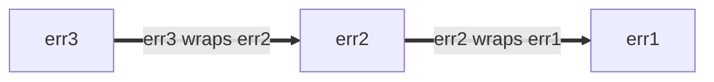

*原著バージョン: https://github.com/google/styleguide/blob/9ae38d43e38a5b182092723d0f1295c3b80b1e06/go/best-practices.md*

# Go Style Best Practices

https://google.github.io/styleguide/go/best-practices

[Overview](index.ja.md) | [Style Guide](guide.ja.md) | [Style Decisions](decisions.ja.md) | [Best practices](best-practices.ja.md)

**Note:** これは、Googleにおける [Go Style](index.ja.md) の概要を説明する一連のドキュメントの一部です。
この文書は **[normative](index.ja.md#normative) と [canonical](index.ja.md#canonical)** です。
詳しくは [the overview](index.ja.md#about) を参照してください。

<a id="about"></a>

## About

このファイルは、「Goスタイルガイド」の最適な適用方法に関する**ガイダンスを文書化したものです**。
このガイダンスは、頻繁に発生する一般的な状況を対象としていますが、すべての状況において適用されるとは限りません。
可能な限り、複数の代替アプローチと、それをいつ適用するか、しないかを決定するための考慮事項が説明されています。

Go Styleのドキュメント一式は [Overview](index.ja.md#about) をご覧ください。

<a id="naming"></a>

## Naming

<a id="function-names"></a>

### Function and method names

<a id="function-name-repetition"></a>

#### Avoid repetition

メソッドの名前を決めるときは、その名前が読まれる文脈を考慮します。
呼び出し先で過剰な [repetition](decision#repetition) (繰り返し) を避けるために、以下の推奨事項を考慮しましょう：

* 関数名やメソッド名には、一般に次のようなものを省略することができます：
  * 入力と出力のタイプ（衝突がない場合）
  * メソッドのレシーバーのタイプ
  * 入力か出力がポインタかどうか

* 機能については、[repeat the name of the package](decisions#repetitive-with-package) (パッケージ名の繰り返し) はしないでください。

    ```go
    // Bad:
    package yamlconfig

    func ParseYAMLConfig(input string) (*Config, error)
    ```

    ```go
    // Good:
    package yamlconfig

    func Parse(input string) (*Config, error)
    ```

* メソッドの場合、メソッドレシーバーの名前を繰り返さない。

    ```go
    // Bad:
    func (c *Config) WriteConfigTo(w io.Writer) (int64, error)
    ```

    ```go
    // Good:
    func (c *Config) WriteTo(w io.Writer) (int64, error)
    ```

* パラメータとして渡される変数名を繰り返さない。

    ```go
    // Bad:
    func OverrideFirstWithSecond(dest, source *Config) error
    ```

    ```go
    // Good:
    func Override(dest, source *Config) error
    ```

* 戻り値の名称や型は繰り返さない。

    ```go
    // Bad:
    func TransformYAMLToJSON(input *Config) *jsonconfig.Config
    ```

    ```go
    // Good:
    func Transform(input *Config) *jsonconfig.Config
    ```

類似した名称の機能を識別する必要がある場合は、追加情報を記載してもよい。

```go
// Good:
func (c *Config) WriteTextTo(w io.Writer) (int64, error)
func (c *Config) WriteBinaryTo(w io.Writer) (int64, error)
```

<a id="function-name-conventions"></a>

#### Naming conventions

関数やメソッドの名前を決める際には、他にもいくつかの共通した慣例があります：

* 何かを返す関数には、名詞のような名前を付けます。

    ```go
    // Good:
    func (c *Config) JobName(key string) (value string, ok bool)
    ```

    このことから、関数やメソッド名は [avoid the prefix `Get`](decisions#getters) (接頭辞の `Get` を避ける) 必要があります。

    ```go
    // Bad:
    func (c *Config) GetJobName(key string) (value string, ok bool)
    ```

* 何かを行う関数には、動詞のような名前を付けます。

    ```go
    // Good:
    func (c *Config) WriteDetail(w io.Writer) (int64, error)
    ```

* 関係する型のみが異なる同一の関数には、その型の名前を名前の末尾に付けます。

    ```go
    // Good:
    func ParseInt(input string) (int, error)
    func ParseInt64(input string) (int64, error)
    func AppendInt(buf []byte, value int) []byte
    func AppendInt64(buf []byte, value int64) []byte
    ```

    明確な "primary" バージョンがある場合、そのバージョンの名前からタイプを省略することができます：

    ```go
    // Good:
    func (c *Config) Marshal() ([]byte, error)
    func (c *Config) MarshalText() (string, error)
    ```

<a id="naming-doubles"></a>

### Test double packages and types

テストヘルパーを提供するパッケージや型の [naming] (命名)、特に [テストダブル] (test doubles) に適用できるいくつかの規律があります。
テストダブルは、スタブ、フェイク、モック、スパイのいずれでも構いません。

これらの例では、ほとんどスタブを使用しています。
もし、あなたのコードがフェイクや他の種類のテストダブルを使用している場合は、それに応じて名前を更新してください。

[naming]: guide#naming
[test doubles]: https://abseil.io/resources/swe-book/html/ch13.html#basic_concepts

例えば、このようなプロダクションコードを提供する、よくできたパッケージがあったとします：

```go
package creditcard

import (
    "errors"

    "path/to/money"
)

// ErrDeclined indicates that the issuer declines the charge.
var ErrDeclined = errors.New("creditcard: declined")

// Card contains information about a credit card, such as its issuer,
// expiration, and limit.
type Card struct {
    // omitted
}

// Service allows you to perform operations with credit cards against external
// payment processor vendors like charge, authorize, reimburse, and subscribe.
type Service struct {
    // omitted
}

func (s *Service) Charge(c *Card, amount money.Money) error { /* omitted */ }
```

<a id="naming-doubles-helper-package"></a>

#### Creating test helper packages

例えば、別のパッケージのテスト用ダブルを含むパッケージを作りたいとします。
この例では、`package creditcard`（上記のもの）を使用することにします：

一つのアプローチとして、テスト用に本番用をベースにした新しいGoパッケージを導入することがあります。
安全な方法は、元のパッケージ名に `test` という単語を追加することです (「creditcard」 + 「test」)：

```go
// Good:
package creditcardtest
```

特に明示しない限り、以下のセクションのすべての例は、`package creditcardtest` に含まれます。

<a id="naming-doubles-simple"></a>

#### Simple case

あなたは `Service` のテスト用ダブルスのセットを追加したいと思います。
`Card` はプロトコルバッファメッセージと同じように、事実上ダムデータ型であるため、テストでは特別な扱いをする必要がなく、ダブルは必要ありません。
もし、1つの型（ `Service` のような）に対してのみテスト用ダブルスを想定しているのであれば、ダブルスの名前に簡潔なアプローチを取ることができます：

```go
// Good:
import (
    "path/to/creditcard"
    "path/to/money"
)

// Stub stubs creditcard.Service and provides no behavior of its own.
type Stub struct{}

func (Stub) Charge(*creditcard.Card, money.Money) error { return nil }
```

これは、`StubService` や非常に悪い `StubCreditCardService` のような命名よりも厳密に好ましいです。
なぜなら、ベースパッケージ名とそのドメインタイプは `creditcardtest.Stub` が何であるかを暗示しています。

最後に、パッケージが Bazel でビルドされている場合、そのパッケージの新しい `go_library` ルールが `testonly` としてマークされていることを確認します：

```build
# Good:
go_library(
    name = "creditcardtest",
    srcs = ["creditcardtest.go"],
    deps = [
        ":creditcard",
        ":money",
    ],
    testonly = True,
)
```

上記の考え方は従来のものであり、他の技術者にもそれなりに理解されるでしょう。

こちらもご参照ください：

* [Go Tip #42: Authoring a Stub for Testing](index.ja.md#gotip)

<a id="naming-doubles-multiple-behaviors"></a>

#### Multiple test double behaviors

1種類のスタブでは不十分な場合（例えば、常に失敗するスタブも必要）、エミュレートする動作に応じてスタブに名前を付けることをお勧めします。
ここでは、`Stub` の名前を `AlwaysCharges` に変更し、`AlwaysDeclines`という新しいスタブを導入しています：

```go
// Good:
// AlwaysCharges stubs creditcard.Service and simulates success.
type AlwaysCharges struct{}

func (AlwaysCharges) Charge(*creditcard.Card, money.Money) error { return nil }

// AlwaysDeclines stubs creditcard.Service and simulates declined charges.
type AlwaysDeclines struct{}

func (AlwaysDeclines) Charge(*creditcard.Card, money.Money) error {
    return creditcard.ErrDeclined
}
```

<a id="naming-doubles-multiple-types"></a>

#### Multiple doubles for multiple types

しかし、ここで、`package creditcard`に、`Service` と `StoredValue` のように、ダブルスを作成する価値のある複数の型が含まれているとします：

```go
package creditcard

type Service struct {
    // omitted
}

type Card struct {
    // omitted
}

// StoredValue manages customer credit balances.  This applies when returned
// merchandise is credited to a customer's local account instead of processed
// by the credit issuer.  For this reason, it is implemented as a separate
// service.
type StoredValue struct {
    // omitted
}

func (s *StoredValue) Credit(c *Card, amount money.Money) error { /* omitted */ }
```

この場合、より明示的なテストダブルの命名が賢明です：

```go
// Good:
type StubService struct{}

func (StubService) Charge(*creditcard.Card, money.Money) error { return nil }

type StubStoredValue struct{}

func (StubStoredValue) Credit(*creditcard.Card, money.Money) error { return nil }
```

<a id="naming-doubles-local-variables"></a>

#### Local variables in tests

テストの変数がダブルを参照する場合、コンテキストに基づいて、ダブルを他のプロダクションタイプから最も明確に区別する名前を選択します。
テストしたいプロダクション・コードを考えてみましょう：

```go
package payment

import (
    "path/to/creditcard"
    "path/to/money"
)

type CreditCard interface {
    Charge(*creditcard.Card, money.Money) error
}

type Processor struct {
    CC CreditCard
}

var ErrBadInstrument = errors.New("payment: instrument is invalid or expired")

func (p *Processor) Process(c *creditcard.Card, amount money.Money) error {
    if c.Expired() {
        return ErrBadInstrument
    }
    return p.CC.Charge(c, amount)
}
```

テストでは、`CreditCard`の "spy" と呼ばれるテストダブルがプロダクションタイプに並置されているので、名前をプレフィックスにすることで分かりやすくなるかもしれませんね。

```go
// Good:
package payment

import "path/to/creditcardtest"

func TestProcessor(t *testing.T) {
    var spyCC creditcardtest.Spy

    proc := &Processor{CC: spyCC}

    // declarations omitted: card and amount
    if err := proc.Process(card, amount); err != nil {
        t.Errorf("proc.Process(card, amount) = %v, want %v", got, want)
    }

    charges := []creditcardtest.Charge{
        {Card: card, Amount: amount},
    }

    if got, want := spyCC.Charges, charges; !cmp.Equal(got, want) {
        t.Errorf("spyCC.Charges = %v, want %v", got, want)
    }
}
```

これは、名前が前に付いていない場合よりも明確です。

```go
// Bad:
package payment

import "path/to/creditcardtest"

func TestProcessor(t *testing.T) {
    var cc creditcardtest.Spy

    proc := &Processor{CC: cc}

    // declarations omitted: card and amount
    if err := proc.Process(card, amount); err != nil {
        t.Errorf("proc.Process(card, amount) = %v, want %v", got, want)
    }

    charges := []creditcardtest.Charge{
        {Card: card, Amount: amount},
    }

    if got, want := cc.Charges, charges; !cmp.Equal(got, want) {
        t.Errorf("cc.Charges = %v, want %v", got, want)
    }
}
```

<a id="shadowing"></a>

### Shadowing

**Note:**
この説明では、*stomping* と *shadowing* という2つの非公式な用語を使っています。
これらは、Go言語仕様の公式な概念ではありません。

多くのプログラミング言語と同様に、Goにはミュータブル変数があり、変数に代入するとその値が変化します。

```go
// Good:
func abs(i int) int {
    if i < 0 {
        i *= -1
    }
    return i
}
```

[short variable declarations] (短い変数宣言) を `:=` 演算子で使用した場合、新しい変数が作成されないケースがあります。
これを *stomping* と呼んでいます。元の値が不要になったときに行うので問題ありません。

```go
// Good:
// innerHandler is a helper for some request handler, which itself issues
// requests to other backends.
func (s *Server) innerHandler(ctx context.Context, req *pb.MyRequest) *pb.MyResponse {
    // Unconditionally cap the deadline for this part of request handling.
    ctx, cancel := context.WithTimeout(ctx, 3*time.Second)
    defer cancel()
    ctxlog.Info(ctx, "Capped deadline in inner request")

    // Code here no longer has access to the original context.
    // This is good style if when first writing this, you anticipate
    // that even as the code grows, no operation legitimately should
    // use the (possibly unbounded) original context that the caller provided.

    // ...
}
```

しかし、新しいスコープで短い変数宣言を使用することには注意が必要です：それは新しい変数を導入することになります。
これを元の変数の *shadowing* と呼ぶことができます。
ブロックの末尾以降のコードは、元の変数を参照します。
ここでは、条件付きで期限を短くするバグ的な試みを紹介します：

```go
// Bad:
func (s *Server) innerHandler(ctx context.Context, req *pb.MyRequest) *pb.MyResponse {
    // Attempt to conditionally cap the deadline.
    if *shortenDeadlines {
        ctx, cancel := context.WithTimeout(ctx, 3*time.Second)
        defer cancel()
        ctxlog.Info(ctx, "Capped deadline in inner request")
    }

    // BUG: "ctx" here again means the context that the caller provided.
    // The above buggy code compiled because both ctx and cancel
    // were used inside the if statement.

    // ...
}
```

正しいバージョンのコードは、次のようになります：

```go
// Good:
func (s *Server) innerHandler(ctx context.Context, req *pb.MyRequest) *pb.MyResponse {
    if *shortenDeadlines {
        var cancel func()
        // Note the use of simple assignment, = and not :=.
        ctx, cancel = context.WithTimeout(ctx, 3*time.Second)
        defer cancel()
        ctxlog.Info(ctx, "Capped deadline in inner request")
    }
    // ...
}
```

stomping と呼んだケースでは、新しい変数がないため、割り当てられる型は元の変数の型と一致しなければなりません。シャドーイングでは、まったく新しい実体を導入するため、異なる型を持つことができます。
意図的なシャドーイングは便利な方法ですが、[clarity](guide.ja.md#clarity) を向上させるのであれば、いつでも新しい名前を使うべきです。

標準パッケージと同じ名前の変数を使用するのは、非常に小さなスコープ以外では良いアイデアではありません。
逆に、パッケージの名前を決めるときは、[import renaming](decisions.ja.md#import-renaming) が必要になりそうな名前、クライアント側で他の良い変数名の shadowing を引き起こすような名前は避けてください。

```go
// Bad:
func LongFunction() {
    url := "https://example.com/"
    // Oops, now we can't use net/url in code below.
}
```

[short variable declarations]: https://go.dev/ref/spec#Short_variable_declarations

<a id="util-packages"></a>

### Util packages

Goのパッケージは、インポートパスとは別に、`package` 宣言で名前を指定します。
パッケージ名は、パスよりも読みやすさを重視したものです。

Goのパッケージ名は [related to what the package provides](decision#package-names) (パッケージが提供するものに関連したもの) であるべきです。
パッケージの名前を `util`, `helper`, `common` などとするのは、通常良くない選択です（名前の *一部* として使用することはできます）。
情報量の少ない名前はコードを読みにくくしますし、あまりに広範に使用すると、不必要な [import conflict](decations#import-renaming) を引き起こす可能性があります。

それよりも、コールサイトがどのようなものになるかを考えてください。

```go
// Good:
db := spannertest.NewDatabaseFromFile(...)

_, err := f.Seek(0, io.SeekStart)

b := elliptic.Marshal(curve, x, y)
```

importsのリスト（`cloud.google.com/go/spanner/spanertest`、`io`、`crypto/elliptic`）を知らなくても、それぞれが何をするかは大体わかると思います。
あまり重視しない名前にすると、以下のようになります：

```go
// Bad:
db := test.NewDatabaseFromFile(...)

_, err := f.Seek(0, common.SeekStart)

b := helper.Marshal(curve, x, y)
```

<a id="package-size"></a>

## Package size

Goパッケージの大きさをどうするか、関連する型を同じパッケージに入れるか、それとも別のパッケージに分けるか、といったことを考えるなら、[Go blog post about package names] [blog-pkg-names] から始めるとよいでしょう。
記事のタイトルとは裏腹に、この記事は命名についてのみ書かれているわけではありません。
この記事には役に立つヒントがいくつか含まれており、役に立つ記事や講演をいくつか引用しています。

その他、検討事項や注意点をご紹介します。

ユーザーはそのパッケージの [godoc] を1ページで見ることができ、そのパッケージが提供する型からエクスポートされるメソッドは、その型によってグループ化されます。
また、Godoc はコンストラクターも、それらが返す型と一緒にグループ化します。
*クライアントコード*が、異なる型の2つの値を相互に作用させる必要がありそうな場合、同じパッケージ内にそれらを持つことは、ユーザーにとって便利かもしれません。

パッケージ内のコードは、そのパッケージ内のエクスポートされていない識別子にアクセスすることができます。
*実装*が緊密に結合しているいくつかの関連型がある場合、それらを同じパッケージに配置することで、パブリックAPIをこれらの詳細で汚染することなく、結合を実現することができます。

とはいえ、プロジェクト全体を1つのパッケージに入れてしまうと、パッケージが大きくなりすぎてしまう可能性があります。
概念的に異なるものには、それ専用の小さなパッケージを与えることで、使いやすくなります。
クライアントが知っているパッケージの短い名前と、エクスポートされた型名が一緒になって、意味のある識別子を作ります：例えば `bytes.Buffer` や `ring.New` などです。[blog post] [blog-pkg-names] に詳しい例があります。

Goスタイルはファイルサイズに柔軟性があります。なぜなら、メンテナは呼び出し元に影響を与えることなく、パッケージ内のコードをあるファイルから別のファイルに移動することができるからです。
しかし、一般的なガイドラインとして、1つのファイルに何千行もあるようなファイルや、小さなファイルをたくさん持つことは、通常良いことではありません。
他の言語のように「一種類、一ファイル」という決まりはありません。
経験則から言えば、ファイルは、メンテナがどのファイルが何かを含んでいるか分かる程度に集約されるべきで、ファイルは、いったんそこにあれば簡単に見つけられる程度に小さくあるべきでしょう。
標準ライブラリでは、大きなパッケージをいくつかのソースファイルに分割し、関連するコードをファイルごとにグループ化することがよくあります。[package `bytes`] のソースはその良い例です。
長いパッケージのドキュメントを持つパッケージでは、`doc.go`という1つのファイルに [package documentation](decision#package-comments) (パッケージドキュメント) とパッケージ宣言、それ以外を記述することもできますが、これは必須ではありません。

GoogleのコードベースやBazelを使用したプロジェクトでは、GoコードのディレクトリレイアウトはオープンソースのGoプロジェクトとは異なります：1つのディレクトリに複数の `go_library` ターゲットを持つことができます。
複数の `go_library` ターゲットを一つのディレクトリに置くことができます。将来的にプロジェクトをオープンソース化することを想定している場合は、各パッケージに独自のディレクトリを与えるのがよいでしょう。

こちらもご参照ください：

* [Test double packages](#naming-doubles)

[blog-pkg-names]: https://go.dev/blog/package-names
[package `bytes`]: https://go.dev/src/bytes/
[godoc]: https://pkg.go.dev/

<a id="imports"></a>

## Imports

<a id="import-protos"></a>

### Protos and stubs

Proto ライブラリのインポートは、言語横断的な性質のため、標準の Go インポートとは異なる扱いを受けます。
リネームされた proto インポートの規約は、パッケージを生成したルールに基づきます：

* `pb` サフィックスは一般的に `go_proto_library` ルールに使用されます。
* `grpc` サフィックスは一般に `go_grpc_library` ルールに使用されます。

一般に、1文字または2文字の短い接頭辞が使われます：

```go
// Good:
import (
    fspb "path/to/package/foo_service_go_proto"
    fsgrpc "path/to/package/foo_service_go_grpc"
)
```

パッケージが使用するプロトが1つだけである場合、またはパッケージがそのプロトと密接に関連している場合は、プレフィックスを省略することができます：

```go
import (
    pb "path/to/package/foo_service_go_proto"
    grpc "path/to/package/foo_service_go_grpc"
)
```

プロトのシンボルが一般的であったり、あまり自明でない場合、あるいは頭文字をとってパッケージ名を短くすることが不明確な場合は、短い単語をプレフィックスとして使用すれば十分です：

```go
// Good:
import (
    mapspb "path/to/package/maps_go_proto"
)
```

この場合、問題のコードがマップに明確に関連していなければ、`mapspb.Address` の方が `mpb.Address` よりも明確かもしれません。

<a id="import-order"></a>

### Import ordering

Import は通常、以下の2つ（またはそれ以上）のブロックに順番に分類されます：

1. 標準ライブラリのインポート (例: `"fmt"`)
2. インポート (例: "/path/to/somelib")
3. (オプション) Protobufのインポート (例: `fpb "path/to/foo_go_proto"`)
4. (オプション) 副作用のインポート (例: `_ "path/to/package"`)

ファイルに上記のオプションカテゴリのグループがない場合、該当するインポートはプロジェクトのインポートグループに含まれます。

インポートのグループ分けは、明確で理解しやすいものであれば、一般的に問題ありません。
例えば、あるチームは gRPC インポートと protobuf インポートを別々にグループ化することを選択することができます。

> **Note:**
> 2つの必須グループ（標準ライブラリ用のグループとその他のすべてのインポート用のグループ）だけを維持するコードでは、`goimports` ツールはこのガイダンスに沿った出力を生成します。
>
> しかし、`goimports` は必須グループ以外のグループについての知識はなく、オプションのグループはツールによって無効化されがちです。
> オプションのグループを使用する場合、著者とレビューアの双方が、グループ分けを遵守するように注意を払う必要があります。
>
> どちらの方法でも構いませんが、インポートセクションを一貫性のない、部分的にグループ化された状態のままにしておかないようにしてください。

<a id="error-handling"></a>

## Error handling

Goでは、[errors are values] (エラーは値) であり、コードによって作成され、コードによって消費されます。
エラーは以下のようなものがあります：

* 人間に表示するための診断情報に変換される
* メンテナに使用される
* エンドユーザーによって解釈される

また、エラーメッセージは、ログメッセージ、エラーダンプ、レンダリングされたUIなど、さまざまな異なる場所で表示されます。

エラーを処理する（生成または消費する）コードは、意図的に行う必要があります。
エラーの返り値を無視したり、やみくもに伝えたりしたくなることがあります。
しかし、コールフレーム内の現在の関数が、エラーを最も効果的に処理できる位置にあるかどうかは、常に検討する価値があります。
これは大きなテーマであり、断定的なアドバイスをすることは困難です。
あなたの判断で、以下のことを心に留めておいてください：

* エラー値を作成する際に、何らかの [structure](#error-structure) を持たせるかどうかを決定します。
* エラーを処理する際には、自分にはあるが呼び出し側や着信側が知らないかもしれない情報を [adding information](#error-extra-info) (追加) ことを考慮する。
* [error logging](#error-logging) に関するガイダンスも参照してください。

通常、エラーを無視することは適切ではありませんが、関連するオペレーションをオーケストレーションする場合は、最初のエラーだけが有用であることが多いので、妥当な例外となります。
パッケージ [`errgroup`] は、グループとして失敗したりキャンセルされたりする操作のグループに対して便利な抽象化を提供します。

[errors are values]: https://go.dev/blog/errors-are-values
[`errgroup`]: https://pkg.go.dev/golang.org/x/sync/errgroup

こちらもご参照ください：

* [Effective Go on errors](https://go.dev/doc/effective_go#errors)
* [A post by the Go Blog on errors](https://go.dev/blog/go1.13-errors)
* [Package `errors`](https://pkg.go.dev/errors)
* [Package `upspin.io/errors`](https://commandcenter.blogspot.com/2017/12/error-handling-in-upspin.html)
* [GoTip #89: When to Use Canonical Status Codes as Errors](index.ja.md#gotip)
* [GoTip #48: Error Sentinel Values](index.ja.md#gotip)
* [GoTip #13: Designing Errors for Checking](index.ja.md#gotip)

<a id="error-structure"></a>

### Error structure

呼び出し元がエラーを調べる必要がある場合（たとえば、異なるエラー状態を区別する）、呼び出し元が文字列の照合を行うのではなく、プログラムによってこれを行うことができるように、エラー値の構造を与えてください。
このアドバイスは、実運用コードだけでなく、さまざまなエラー状態を気にするテストにも適用されます。

最も単純な構造化エラーは、パラメータ化されていないグローバル値です。

```go
type Animal string

var (
    // ErrDuplicate occurs if this animal has already been seen.
    ErrDuplicate = errors.New("duplicate")

    // ErrMarsupial occurs because we're allergic to marsupials outside Australia.
    // Sorry.
    ErrMarsupial = errors.New("marsupials are not supported")
)

func pet(animal Animal) error {
    switch {
    case seen[animal]:
        return ErrDuplicate
    case marsupial(animal):
        return ErrMarsupial
    }
    seen[animal] = true
    // ...
    return nil
}
```

呼び出し側は、関数の返すエラー値を、既知のエラー値のいずれかと比較するだけで良いことになります：

```go
// Good:
func handlePet(...) {
    switch err := process(an); err {
    case ErrDuplicate:
        return fmt.Errorf("feed %q: %v", an, err)
    case ErrMarsupial:
        // Try to recover with a friend instead.
        alternate = an.BackupAnimal()
        return handlePet(..., alternate, ...)
    }
}
```

上記ではセンチネル値を使用しており、誤差は期待値と等しくなければなりません（`==`という意味で）。
これは多くの場合、完全に適切です。
もし `process` がラップされたエラーを返す場合（後述）、[`errors.Is`] を使用することができます。

```go
// Good:
func handlePet(...) {
    switch err := process(an); {
    case errors.Is(err, ErrDuplicate):
        return fmt.Errorf("feed %q: %v", an, err)
    case errors.Is(err, ErrMarsupial):
        // ...
    }
}
```

文字列の形からエラーを区別しようとしないでください。
 (詳しくは [Go Tip #13: Designing Errors for Checking](index.ja.md#gotip) を参照してください)。

```go
// Bad:
func handlePet(...) {
    err := process(an)
    if regexp.MatchString(`duplicate`, err.Error()) {...}
    if regexp.MatchString(`marsupial`, err.Error()) {...}
}
```

エラーの中に呼び出し側がプログラムで必要とする追加情報がある場合、それは理想的には構造的に提示されるべきです。
例えば、[`os.PathError`] 型は、失敗した操作のパス名を呼び出し元が簡単にアクセスできる構造体フィールドに配置するように文書化されています。

例えば、エラーコードと詳細文字列を含むプロジェクト構造体のように、他のエラー構造を適切に使用することができます。
[Package `status`] [status] は一般的なカプセル化です。この方法を選択する場合 (そうする義務はありません)、 [canonical codes] を使用してください。
ステータスコードを使うのが正しい選択かどうかは、[Go Tip #89: When to Use Canonical Status Codes as Errors](index.ja.md#gotip) を参照してください。

[`os.PathError`]: https://pkg.go.dev/os#PathError
[`errors.Is`]: https://pkg.go.dev/errors#Is
[status]: https://pkg.go.dev/google.golang.org/grpc/status
[canonical codes]: https://pkg.go.dev/google.golang.org/grpc/codes

<a id="error-extra-info"></a>

### Adding information to errors

エラーを返す関数は、そのエラー値を有用なものにするよう努力する必要があります。
多くの場合、その関数はコールチェーンの途中にあり、呼び出した他の関数（もしかしたら他のパッケージからのものもあるかもしれません）からのエラーを単に伝播しているだけです。
この場合、エラーに追加情報を付ける機会がありますが、プログラマはエラーに十分な情報があることを確認し、重複する情報や無関係な情報を付けないようにしなければなりません。
もし確信が持てない場合は、開発中にエラー条件をトリガーしてみてください。これは、エラーの観察者（人間またはコード）が最終的に何を得るかを評価する良い方法です。

慣例と優れた文書が助けになります。
例えば、標準パッケージである `os` は、エラーにパス情報が含まれていることを知らせています（パス情報が利用可能な場合）。
これは便利なスタイルです。なぜなら、エラーを返された呼び出し側は、失敗した関数をすでに提供していたことを知らせるために、エラーを注釈する必要がなくなるからです。

```go
// Good:
if err := os.Open("settings.txt"); err != nil {
    return err
}

// Output:
//
// open settings.txt: no such file or directory
```

エラーの*意味*について何か興味深いことがあれば、もちろんそれを追加することができます。
ただ、コールチェーンのどのレベルがこの意味を理解するのに最適なのかを考えてみてください。

```go
// Good:
if err := os.Open("settings.txt"); err != nil {
    // We convey the significance of this error to us. Note that the current
    // function might perform more than one file operation that can fail, so
    // these annotations can also serve to disambiguate to the caller what went
    // wrong.
    return fmt.Errorf("launch codes unavailable: %v", err)
}

// Output:
//
// launch codes unavailable: open settings.txt: no such file or directory
```

ここで冗長な情報と対比してください：

```go
// Bad:
if err := os.Open("settings.txt"); err != nil {
    return fmt.Errorf("could not open settings.txt: %w", err)
}

// Output:
//
// could not open settings.txt: open settings.txt: no such file or directory
```

伝播されたエラーに情報を追加する場合、エラーをラップするか、新しいエラーを提示するかのどちらかになります。
fmt.Errorf`の`%w`動詞でエラーをラップすると、呼び出し元が元のエラーのデータにアクセスすることができます。
これは時に非常に便利ですが、他のケースでは、これらの詳細は呼び出し側にとって誤解を招いたり、興味がなかったりします。
詳しくは、[blog post on error wrapping](https://blog.golang.org/go1.13-errors) をご覧ください。
また、エラーをラップすることで、パッケージのAPI表面を明白でない方法で拡張することになり、パッケージの実装の詳細を変更した場合に破損の原因となることがあります。

公開するエラーの根底にあるものを文書化し、それを検証するテストがない限り、 `%w` の使用は避けた方がよいでしょう。
呼び出し元が `errors.Unwrap` や `errors.Is` などを呼び出すことを想定していない場合は、わざわざ `%w` を使用しなくてもよいでしょう。

同じコンセプトが [`*status.Status`] [status] のような [structured errors](#error-structure) にも適用されます ([canonical codes] 参照)。
例えば、サーバがバックエンドに不正なリクエストを送り、 `InvalidArgument` コードを受け取った場合、クライアントが何も悪いことをしていないと仮定して、このコードをクライアントに伝えるべきでは *ありません*。
その代わりに、`Internal` という正規のコードをクライアントに返します。

しかし、エラーに注釈を付けることで、自動記録システムがエラーのステータスペイロードを保持するのに役立ちます。
例えば、内部関数では、エラーに注釈を付けることが適切です：

```go
// Good:
func (s *Server) internalFunction(ctx context.Context) error {
    // ...
    if err != nil {
        return fmt.Errorf("couldn't find remote file: %w", err)
    }
}
```

システム境界に直接位置するコード（典型的にはRPC、IPC、ストレージ、および同様のもの）は、正規のエラー空間を使用してエラーを報告する必要があります。
ドメイン固有のエラーを処理し、それを正規に表現するのは、ここでのコードの責任です。
例えば、次のようなものです：

```go
// Bad:
func (*FortuneTeller) SuggestFortune(context.Context, *pb.SuggestionRequest) (*pb.SuggestionResponse, error) {
    // ...
    if err != nil {
        return nil, fmt.Errorf("couldn't find remote file: %w", err)
    }
}
```

```go
// Good:
import (
    "google.golang.org/grpc/codes"
    "google.golang.org/grpc/status"
)
func (*FortuneTeller) SuggestFortune(context.Context, *pb.SuggestionRequest) (*pb.SuggestionResponse, error) {
    // ...
    if err != nil {
        // Or use fmt.Errorf with the %w verb if deliberately wrapping an
        // error which the caller is meant to unwrap.
        return nil, status.Errorf(codes.Internal, "couldn't find fortune database", status.ErrInternal)
    }
}
```

<a id="error-percent-w"></a>

### Placement of %w in errors

エラー文字列の末尾に `%w` を置くことを推奨します。

エラーは [the `%w` verb](https://blog.golang.org/go1.13-errors) (`%w` 動詞) でラップするか、`Unwrap() error` (例: [`fs.PathError`](https://pkg.go.dev/io/fs#PathError) ) を実装した [structured error](index.ja.md#gotip) に格納することが可能です。

ラップされたエラーはエラーチェーンを形成します。ラップの新しいレイヤーが増えるごとに、エラーチェーンの先頭に新しいエントリーが追加されます。
エラーチェーンは `Unwrap() error` メソッドでたどることができます。
例えば、以下のようになります：

```go
err1 := fmt.Errorf("err1")
err2 := fmt.Errorf("err2: %w", err1)
err3 := fmt.Errorf("err3: %w", err2)
```

エラーチェーンが形成されます、



`w` 動詞をどこに配置しても、返されるエラーは常にエラーチェーンの先頭を表し、`%w` はその次の子です。
同様に、`Unwrap() error` は常にエラーチェーンを新しいものから古いものへと走査します。

しかし、`%w` 動詞の配置は、エラーチェインを新しいものから古いものへ、古いものから新しいものへ、またはそのどちらでもなく表示するかに影響します：

```go
// Good:
err1 := fmt.Errorf("err1")
err2 := fmt.Errorf("err2: %w", err1)
err3 := fmt.Errorf("err3: %w", err2)
fmt.Println(err3) // err3: err2: err1
// err3 is a newest-to-oldest error chain, that prints newest-to-oldest.
```

```go
// Bad:
err1 := fmt.Errorf("err1")
err2 := fmt.Errorf("%w: err2", err1)
err3 := fmt.Errorf("%w: err3", err2)
fmt.Println(err3) // err1: err2: err3
// err3 is a newest-to-oldest error chain, that prints oldest-to-newest.
```

```go
// Bad:
err1 := fmt.Errorf("err1")
err2 := fmt.Errorf("err2-1 %w err2-2", err1)
err3 := fmt.Errorf("err3-1 %w err3-2", err2)
fmt.Println(err3) // err3-1 err2-1 err1 err2-2 err3-2
// err3 is a newest-to-oldest error chain, that neither prints newest-to-oldest
// nor oldest-to-newest.
```

したがって、エラーテキストがエラーチェーンの構造を反映するためには、`%w` 動詞を最後に置き、`[...]: %w` という形にする必要があります。

<a id="error-logging"></a>

### Logging errors

関数では、呼び出し元にエラーを伝えず、外部のシステムにエラーを伝える必要がある場合があります。
このような場合、ログを記録するのが一般的ですが、何をどのように記録するかには注意が必要です。

* Like [good test failure messages], log messages should clearly express what went wrong and help the maintainer by including relevant information to diagnose the problem.

* 重複を避ける。エラーを返した場合、通常は自分でログを取らず、呼び出し元に処理させる方が良いでしょう。
  呼び出し側は、エラーをログに記録するか、あるいは [`rate.Sometimes`] を使用してロギングを制限するかを選択することができます。
  その他、リカバリーを試みる、あるいは [stopping the program] (プログラムを停止する) という選択肢もあります。
  いずれにせよ、発信者にコントロールを与えることで、ログスパムを回避することができます。
  
  しかし、この方法の欠点は、すべてのログが呼び出し側のラインコーディネートに基づいて記述されることです。

* [PII] に注意してください。多くのログシンクは、機密性の高いエンドユーザー情報の送信先として適切ではありません。

* `log.Error`は控えめに使ってください。
  ERROR レベルのロギングはフラッシュを引き起こし、より低いロギングレベルよりもコストがかかります。
  これは、あなたのコードに深刻なパフォーマンスの影響を与える可能性があります。
  エラーと警告のレベルを決める際には、エラーレベルのメッセージは警告よりも「より深刻」ではなく「アクション可能」であるべきというベストプラクティスを考慮してください。

* Google 内部では、ログファイルに書き込んで誰かが気づいてくれるのを期待するよりも、より効果的な警告を発するように設定できる監視システムがあります。
  これは、標準ライブラリ [package `expvar`] と似ていますが、同じではありません。

[good test failure messages]: decisions.ja.md#useful-test-failures
[stopping the program]: #checks-and-panics
[`rate.Sometimes`]: https://pkg.go.dev/golang.org/x/time/rate#Sometimes
[PII]: https://en.wikipedia.org/wiki/Personal_data
[package `expvar`]: https://pkg.go.dev/expvar

<a id="vlog"></a>

#### Custom verbosity levels

詳細なロギング（[`log.V`]）を上手に使いこなしましょう。
詳細なロギングは、開発やトレーシングに役立ちます。
詳細度に関する規約を確立することは有用です。
例えば、次のような感じです：

* `V(1)`のところに少し余分な情報を書く。
* `V(2)`でより多くの情報をトレースする。
* `V(3)`の大きな内部状態をダンプする。

詳細なロギングのコストを最小化するために、`log.V` がオフになっているときでも、誤って高価な関数を呼び出さないようにする必要があります。
`log.V` は2つのAPIを提供しています。
より便利な方は、この偶発的な出費のリスクを伴います。
疑問がある場合は、少し冗長な方のスタイルを使用してください。

```go
// Good:
for _, sql := range queries {
  log.V(1).Infof("Handling %v", sql)
  if log.V(2) {
    log.Infof("Handling %v", sql.Explain())
  }
  sql.Run(...)
}
```

```go
// Bad:
// sql.Explain called even when this log is not printed.
log.V(2).Infof("Handling %v", sql.Explain())
```

[`log.V`]: https://pkg.go.dev/github.com/golang/glog#V

<a id="program-init"></a>

### Program initialization

プログラムの初期化エラー（不正なフラグや設定など）は `main` に伝搬され、エラーを修正する方法を説明するエラーとともに `log.Exit` を呼び出す必要があります。
このような場合、一般的に `log.Fatal` を使用すべきではありません。なぜなら、チェックを示すスタックトレースは、人間が生成した実行可能なメッセージほど有用でない可能性が高いからです。

<a id="checks-and-panics"></a>

### Program checks and panics

[decision against panics] (パニックに対する決定) で述べたように、標準的なエラー処理は、エラー返り値を中心に構成されるべきです。
ライブラリは、特に一過性のエラーの場合、プログラムを中断するよりも、呼び出し元にエラーを返すことを優先すべきです。

不変量に対して整合性チェックを行い、違反した場合はプログラムを終了させる必要がある場合があります。
一般に、これは不変量チェックの失敗によって内部状態が回復不可能になった場合にのみ行います。
Google のコードベースでこれを行う最も確実な方法は、 `log.Fatal` を呼び出すことです。
このような場合に `panic` を使用すると、遅延した関数がデッドロックを起こしたり、内部や外部の状態をさらに破損させたりする可能性があるため、信頼性が低くなります。

同様に、クラッシュを避けるためにパニックを回復させようとする誘惑に負けないでください。そうすることで、破損した状態を伝播させる結果になりかねません。
パニックから離れれば離れるほど、ロックや他のリソースを保持している可能性のあるプログラムの状態について知ることができなくなります。
そして、プログラムは他の予期せぬ故障モードを開発し、問題の診断をさらに難しくする可能性があります。
予期せぬパニックをコードで処理しようとするのではなく、監視ツールを使って予期せぬ障害を表面化させ、関連するバグを高い優先順位で修正するようにしましょう。

**Note:**
標準的な [`net/http` server] はこのアドバイスに違反し、リクエストハンドラからパニックを回復しています。
経験豊富なGoエンジニアの間では、これは歴史的な誤りであるというのがコンセンサスです。
他の言語のアプリケーションサーバーのサーバーログをサンプリングすると、処理されないまま放置されている大きなスタックトレースが見つかることがよくあります。
あなたのサーバーでは、この落とし穴を避けてください。

[decision against panics]: decisions.ja.md#dont-panic
[`net/http` server]: https://pkg.go.dev/net/http#Server

<a id="when-to-panic"></a>

### When to panic

標準ライブラリはAPIの誤用に対してパニックを起こします。
例えば、[`reflect`]は、値が誤って解釈されたことを示唆するような方法でアクセスされた多くのケースでパニックを発生させます。
これは、境界を越えたスライスの要素にアクセスするようなコア言語のバグに対するパニックと類似しています。
コードレビューとテストによって、このようなバグが発見されるべきです。このようなバグは、実運用コードに現れないことを期待されています。
標準ライブラリは、Googleコードベースが使用している [levelled `log`] パッケージにアクセスできないため、これらのパニックは、ライブラリに依存しない不変性チェックとして機能します。

[`reflect`]: https://pkg.go.dev/reflect
[levelled `log`]: decisions.ja.md#logging

パニックが有用なもう一つのケースは、珍しいことですが、コールチェーンに常に一致するリカバリを持つパッケージの内部実装の詳細としてです。
パーサーや、深くネストされ、緊密に結合された内部関数群は、この設計の恩恵を受けることができます。
この設計の重要な特徴は、これらのパニックがパッケージの境界を越えてエスケープすることを決して許さず、パッケージのAPIの一部を形成しないことです。
これは、伝播するパニックをパブリックAPI表面で返されるエラーに変換するトップレベルの遅延回復で通常達成されます。

パニックは、コンパイラが到達不可能なコードを特定できない場合にも使用されます。例えば、`log.Fatal`のような戻り値のない関数を使用した場合などです：

```go
// Good:
func answer(i int) string {
    switch i {
    case 42:
        return "yup"
    case 54:
        return "base 13, huh"
    default:
        log.Fatalf("Sorry, %d is not the answer.", i)
        panic("unreachable")
    }
}
```

[フラグが解析される前に `log` 関数を呼び出さないでください。](https://pkg.go.dev/github.com/golang/glog#pkg-overview)
もし `init` func で die しなければならない場合、ロギング呼び出しの代わりにパニックが許容されます。

<a id="documentation"></a>

## Documentation

<a id="documentation-conventions"></a>

### Conventions

このセクションは、決定文書の[commentary]セクションを補強するものです。

使い慣れたスタイルで文書化されたGoコードは、誤った文書化されたものや全く文書化されていないものよりも読みやすく、誤用される可能性も低くなります。
実行可能な [examples] は Godoc や Code Search に表示され、あなたのコードの使い方を説明するのに優れた方法です。

[examples]: decisions.ja.md#examples

<a id="documentation-conventions-params"></a>

#### Parameters and configuration

すべてのパラメータがドキュメントに列挙されている必要はありません。
これは、以下のような場合に適用されます：

* 関数とメソッドのパラメータ
* 構造体フィールド
* オプションのAPI

エラーが起きやすい、または目立たないフィールドやパラメータについては、なぜそれが重要なのかを説明しましょう。

次のスニペットでは、ハイライトされた解説は読者にとって有益な情報をほとんど提供していません：

```go
// Bad:
// Sprintf formats according to a format specifier and returns the resulting
// string.
//
// format is the format, and data is the interpolation data.
func Sprintf(format string, data ...interface{}) string
```

しかし、今回の例では、前回とよく似たコードシナリオが示されており、解説文には、読者にとって自明でないことや重要なことが記載されています：

```go
// Good:
// Sprintf formats according to a format specifier and returns the resulting
// string.
//
// The provided data is used to interpolate the format string. If the data does
// not match the expected format verbs or the amount of data does not satisfy
// the format specification, the function will inline warnings about formatting
// errors into the output string as described by the Format errors section
// above.
func Sprintf(format string, data ...interface{}) string
```

何をどの程度の深さで文書化するかを選択する際には、想定される読者を考慮してください。
メンテナンス担当者、チームの新人、外部ユーザー、そして6ヶ月後の自分自身でさえ、最初にドキュメントを書こうとしたときに考えていたこととは少し違った情報を評価するかもしれません。

こちらもご参照ください：

* [GoTip #41: Identify Function Call Parameters]
* [GoTip #51: Patterns for Configuration]

[commentary]: decisions.ja.md#commentary
[GoTip #41: Identify Function Call Parameters]: index.ja.mdgotip
[GoTip #51: Patterns for Configuration]: index.ja.md#gotip

<a id="documentation-conventions-contexts"></a>

#### Contexts

コンテキスト引数のキャンセルは、それが提供される関数を中断させることを意味します。
その関数がエラーを返すことができる場合、慣習的に `ctx.Err()` となります。

この事実は、改めて説明するまでもないでしょう：

```go
// Bad:
// Run executes the worker's run loop.
//
// The method will process work until the context is cancelled and accordingly
// returns an error.
func (Worker) Run(ctx context.Context) error
```

それが暗黙の了解になっているため、以下のようにするのが良いでしょう：

```go
// Good:
// Run executes the worker's run loop.
func (Worker) Run(ctx context.Context) error
```

コンテキストの動作が異なる場合、または自明でない場合は、明示的に文書化する必要があります：

* コンテキストがキャンセルされたときに、関数が `ctx.Err()` 以外のエラーを返す場合：

    ```go
    // Good:
    // Run executes the worker's run loop.
    //
    // If the context is cancelled, Run returns a nil error.
    func (Worker) Run(ctx context.Context) error
    ```

* その機能が他の機構によって中断されたり、ライフタイムに影響を及ぼす可能性がある場合：

    ```go
    // Good:
    // Run executes the worker's run loop.
    //
    // Run processes work until the context is cancelled or Stop is called.
    // Context cancellation is handled asynchronously internally: run may return
    // before all work has stopped. The Stop method is synchronous and waits
    // until all operations from the run loop finish. Use Stop for graceful
    // shutdown.
    func (Worker) Run(ctx context.Context) error

    func (Worker) Stop()
    ```

* 関数が、コンテキストのライフタイム、出自、付属値について特別な意味を持つ場合：

    ```go
    // Good:
    // NewReceiver starts receiving messages sent to the specified queue.
    // The context should not have a deadline.
    func NewReceiver(ctx context.Context) *Receiver

    // Principal returns a human-readable name of the party who made the call.
    // The context must have a value attached to it from security.NewContext.
    func Principal(ctx context.Context) (name string, ok bool)
    ```

    **Warning:**
    呼び出し側にそのような要求（コンテキストに期限がないなど）をするようなAPIを設計することは避けてください。上記は、避けられない場合にどのように文書化するかの一例であり、このパターンを推奨するものではありません。

<a id="documentation-conventions-concurrency"></a>

#### Concurrency

Goのユーザーは、概念的に読み取り専用の操作は同時並行で使用しても安全であり、余分な同期を必要としないと考えています。

このGodocでは、同時実行に関する不要な発言は安全に削除することができます：

```go
// Len returns the number of bytes of the unread portion of the buffer;
// b.Len() == len(b.Bytes()).
//
// It is safe to be called concurrently by multiple goroutines.
func (*Buffer) Len() int
```

しかし、更新操作は、同時使用に対して安全であるとは想定されておらず、ユーザは同期を考慮することが必要です。

同様に、同時実行に関する不必要な記述は、ここでは安全に削除することができます：

```go
// Grow grows the buffer's capacity.
//
// It is not safe to be called concurrently by multiple goroutines.
func (*Buffer) Grow(n int)
```

以下の場合は、文書化が強く推奨されます：

* 操作の内容が読み取り専用なのか、変更なのかが不明確な場合

    ```go
    // Good:
    package lrucache

    // Lookup returns the data associated with the key from the cache.
    //
    // This operation is not safe for concurrent use.
    func (*Cache) Lookup(key string) (data []byte, ok bool)
    ```

    Why? A cache hit when looking up the key mutate a LRU cache internally. How
    this is implemented may not be obvious to all readers.

* 同期がAPIで提供される場合

    ```go
    // Good:
    package fortune_go_proto

    // NewFortuneTellerClient returns an *rpc.Client for the FortuneTeller service.
    // It is safe for simultaneous use by multiple goroutines.
    func NewFortuneTellerClient(cc *rpc.ClientConn) *FortuneTellerClient
    ```

    なぜか？Stubby は同期を提供します。

    **Note:**
    APIが型であり、APIが全体として同期を提供する場合、通常は型定義のみがセマンティクスを文書化します。

* APIはユーザーが実装したタイプのインターフェースを使用し、インターフェースの利用者は特定の並行性要件をもっている場合

    ```go
    // Good:
    package health

    // A Watcher reports the health of some entity (usually a backend service).
    //
    // Watcher methods are safe for simultaneous use by multiple goroutines.
    type Watcher interface {
        // Watch sends true on the passed-in channel when the Watcher's
        // status has changed.
        Watch(changed chan<- bool) (unwatch func())

        // Health returns nil if the entity being watched is healthy, or a
        // non-nil error explaining why the entity is not healthy.
        Health() error
    }
    ```

    なぜか？API が複数のゴルーチンで使っても安全かどうかは、その契約の一部だからです。

<a id="documentation-conventions-cleanup"></a>

#### Cleanup

APIが持つ明示的なクリーンアップ要件を文書化しましょう。
そうしないと、呼び出し元がAPIを正しく使用できず、リソースリークやその他のバグが発生する可能性があります。

呼び出し側に任されているクリーンアップを呼び出します：

```go
// Good:
// NewTicker returns a new Ticker containing a channel that will send the
// current time on the channel after each tick.
//
// Call Stop to release the Ticker's associated resources when done.
func NewTicker(d Duration) *Ticker

func (*Ticker) Stop()
```

リソースのクリーンアップ方法が不明確な可能性がある場合、その方法を説明すること：

```go
// Good:
// Get issues a GET to the specified URL.
//
// When err is nil, resp always contains a non-nil resp.Body.
// Caller should close resp.Body when done reading from it.
//
//    resp, err := http.Get("http://example.com/")
//    if err != nil {
//        // handle error
//    }
//    defer resp.Body.Close()
//    body, err := io.ReadAll(resp.Body)
func (c *Client) Get(url string) (resp *Response, err error)
```

<a id="documentation-preview"></a>

### Preview

Go は [documentation server](https://pkg.go.dev/golang.org/x/pkgsite/cmd/pkgsite) を備えています。
コードレビューの前や最中に、あなたのコードが作成するドキュメントをプレビューすることが推奨されます。
これは、[godoc formatting] が正しく表示されることを検証するのに役立ちます。

[godoc formatting]: #godoc-formatting

<a id="godoc-formatting"></a>

### Godoc formatting

[Godoc] は [format documentation] にいくつかの特定の構文を提供します。

* 段落を区切るには空白行が必要です：

    ```go
    // Good:
    // LoadConfig reads a configuration out of the named file.
    //
    // See some/shortlink for config file format details.
    ```

* テストファイルには、godocの対応するドキュメントに添付されて表示される [runnable examples] (実行可能なサンプル) を含めることができます：

    ```go
    // Good:
    func ExampleConfig_WriteTo() {
      cfg := &Config{
        Name: "example",
      }
      if err := cfg.WriteTo(os.Stdout); err != nil {
        log.Exitf("Failed to write config: %s", err)
      }
      // Output:
      // {
      //   "name": "example"
      // }
    }
    ```

* 行をさらに2スペース分インデントすることで、その行をそのままの形で表示します：

    ```go
    // Good:
    // Update runs the function in an atomic transaction.
    //
    // This is typically used with an anonymous TransactionFunc:
    //
    //   if err := db.Update(func(state *State) { state.Foo = bar }); err != nil {
    //     //...
    //   }
    ```

    Note, しかし、コメントでコードを記述するよりも、実行可能なサンプルにコードを記述する方が適切な場合があります。

    この逐語的な書式は、リストやテーブルなど、godoc のネイティブではない書式に活用できます：

    ```go
    // Good:
    // LoadConfig reads a configuration out of the named file.
    //
    // LoadConfig treats the following keys in special ways:
    //   "import" will make this configuration inherit from the named file.
    //   "env" if present will be populated with the system environment.
    ```

* 大文字で始まり、括弧とカンマ以外の句読点を含まず、その後に別の段落が続く1行は、ヘッダーとしてフォーマットされます：

    ```go
    // Good:
    // The following line is formatted as a heading.
    //
    // Using headings
    //
    // Headings come with autogenerated anchor tags for easy linking.
    ```

[Godoc]: https://pkg.go.dev/
[format documentation]: https://go.dev/doc/comment
[runnable examples]: decisions#examples

<a id="signal-boost"></a>

### Signal boosting

あるコード行が一般的なもののように見えて、実はそうでないことがあります。
その最たる例が、`err == nil` チェックです（ `err != nil` の方がずっと一般的なので）。
次の2つの条件チェックは見分けがつきにくいです：

```go
// Good:
if err := doSomething(); err != nil {
    // ...
}
```

```go
// Bad:
if err := doSomething(); err == nil {
    // ...
}
```

その代わり、コメントをつけることで条件の合図を "boost" することができます：

```go
// Good:
if err := doSomething(); err == nil { // if NO error
    // ...
}
```

コメントでは、条件の違いに注目しています。

<a id="vardecls"></a>

## Variable declarations

<a id="vardeclinitialization"></a>

### Initialization

新しい変数をゼロ以外の値で初期化する場合は、一貫性を保つために `var` よりも `:=` を優先してください。

```go
// Good:
i := 42
```

```go
// Bad:
var i = 42
```

<a id="vardeclzero"></a>

### Non-pointer zero values

以下の宣言では、[zero value] (ゼロ値) を使用しています：

```go
// Good:
var (
    coords Point
    magic  [4]byte
    primes []int
)
```

[zero value]: https://golang.org/ref/spec#The_zero_value

ゼロ値を使って値を宣言するのは、**後で使用できるように準備された空の値を伝えたいときです**。
明示的な初期化で複合リテラルを使用すると、不便になることがあります：

```go
// Bad:
var (
    coords = Point{X: 0, Y: 0}
    magic  = [4]byte{0, 0, 0, 0}
    primes = []int(nil)
)
```

ゼロ値宣言の一般的な応用例として、アンマーシャルの際に変数を出力として使用する場合があります：

```go
// Good:
var coords Point
if err := json.Unmarshal(data, &coords); err != nil {
```

構造体の中にロックや [must not be copied](decision.ja.md#copying) (コピーしてはいけない) フィールドが必要な場合、それを値型にしてゼロ値初期化の利点を生かすことができます。
構造体が含む型は、値ではなくポインタを介して渡さなければならなくなります。
その型に対するメソッドは、ポインタのレシーバーを取らなければなりません。

```go
// Good:
type Counter struct {
    // This field does not have to be "*sync.Mutex". However,
    // users must now pass *Counter objects between themselves, not Counter.
    mu   sync.Mutex
    data map[string]int64
}

// Note this must be a pointer receiver to prevent copying.
func (c *Counter) IncrementBy(name string, n int64)
```

複合体（構造体や配列など）のローカル変数には、コピー不可能なフィールドが含まれていても、値型を使用することができます。
しかし、複合体が関数から返される場合、あるいは複合体へのアクセスがすべてアドレスを取る必要がある場合は、最初にポインタ型として宣言しておくことをお勧めします。
同様に、プロトバフもポインタ型として宣言する必要があります。

```go
// Good:
func NewCounter(name string) *Counter {
    c := new(Counter) // "&Counter{}" is also fine.
    registerCounter(name, c)
    return c
}

var myMsg = new(pb.Bar) // or "&pb.Bar{}".
```

これは、`*pb.Something` が [`proto.Message`] を満たすのに対し、`pb.Something` は満たさないからです。

```go
// Bad:
func NewCounter(name string) *Counter {
    var c Counter
    registerCounter(name, &c)
    return &c
}

var myMsg = pb.Bar{}
```

[`proto.Message`]: https://pkg.go.dev/google.golang.org/protobuf/proto#Message

> **Important:**
> Map 型は、変更する前に明示的に初期化する必要があります。
> ただし、ゼロ値mapからの読み出しは全く問題ありません。
>
> マップ型やスライス型の場合、特にパフォーマンスに気を使うコードで、事前にサイズがわかっている場合は、[size hints](#vardeclsize) (サイズのヒント) の項目を参照してください。

<a id="vardeclcomposite"></a>

### Composite literals

以下は、[composite literal] (複合リテラル) 宣言です：

```go
// Good:
var (
    coords   = Point{X: x, Y: y}
    magic    = [4]byte{'I', 'W', 'A', 'D'}
    primes   = []int{2, 3, 5, 7, 11}
    captains = map[string]string{"Kirk": "James Tiberius", "Picard": "Jean-Luc"}
)
```

初期要素やメンバがわかっている場合は、複合リテラルを使って値を宣言すべきです。

一方、複合リテラルを使って空やメンバーレスの値を宣言すると、[zero-value initialization](#vardeclzero) (ゼロ値初期化) と比べて視覚的にうるさくなることがあります。

ゼロ値へのポインタが必要な場合、空の複合リテラルと `new` という2つのオプションがあります。
どちらも問題ありませんが、`new`キーワードは、ゼロでない値が必要な場合、複合リテラルは使えないということを読者に気づかせる役割を果たします：

```go
// Good:
var (
  buf = new(bytes.Buffer) // non-empty Buffers are initialized with constructors.
  msg = new(pb.Message) // non-empty proto messages are initialized with builders or by setting fields one by one.
)
```

[composite literal]: https://golang.org/ref/spec#Composite_literals

<a id="vardeclsize"></a>

### Size hints

以下は、容量を事前に確保するために、サイズヒントを利用した宣言です：

```go
// Good:
var (
    // Preferred buffer size for target filesystem: st_blksize.
    buf = make([]byte, 131072)
    // Typically process up to 8-10 elements per run (16 is a safe assumption).
    q = make([]Node, 0, 16)
    // Each shard processes shardSize (typically 32000+) elements.
    seen = make(map[string]bool, shardSize)
)
```

サイズヒントと事前割当は、**コードの実証的分析とその統合**を組み合わせることで、パフォーマンスに配慮したリソース効率の高いコードを作成するための重要なステップです。

ほとんどのコードでは、サイズのヒントや事前割り当てを必要とせず、必要に応じてランタイムがスライスやマップを拡大することができます。
最終的なサイズがわかっている場合（マップとスライスの間で変換する場合など）には、事前割り当てを行ってもかまいませんが、これは可読性の要件ではありませんし、小さなケースでは混乱を招く可能性があるので、その価値はありません。

**Warning:**
必要以上のメモリをあらかじめ割り当てておくと、フリート内のメモリが無駄になったり、パフォーマンスに悪影響を及ぼすこともあります。
迷ったら、[GoTip #3: Benchmarking Go Code] を参照して、[zero initialization](#vardeclzero) (ゼロ初期化) または [composite literal declaration](#vardeclcomposite) (複合リテラル宣言) をデフォルトにしてください。

[GoTip #3: Benchmarking Go Code]: index.ja.md#gotip

<a id="decl-chan"></a>

### Channel direction

可能な限り [channel direction] (チャンネル方向) を指定してください。

```go
// Good:
// sum computes the sum of all of the values. It reads from the channel until
// the channel is closed.
func sum(values <-chan int) int {
    // ...
}
```

これにより、仕様がない場合に起こりうる、気軽なプログラムミスを防ぐことができます：

```go
// Bad:
func sum(values chan int) (out int) {
    for v := range values {
        out += v
    }
    // values must already be closed for this code to be reachable, which means
    // a second close triggers a panic.
    close(values)
}
```

方向が指定されていると、コンパイラはこのような単純なエラーを捕らえることができます。
また、型に対する所有権の尺度を伝えるのにも役立ちます。

Bryan Mills の講演 "Rethinking Classical Concurrency Patterns" も参照してください：
[slides][rethinking-concurrency-slides] [video][rethinking-concurrency-video].

[rethinking-concurrency-slides]: https://drive.google.com/file/d/1nPdvhB0PutEJzdCq5ms6UI58dp50fcAN/view?usp=sharing
[rethinking-concurrency-video]: https://www.youtube.com/watch?v=5zXAHh5tJqQ
[channel direction]: https://go.dev/ref/spec#Channel_types

<a id="funcargs"></a>

## Function argument lists

関数のシグネチャーを長くしすぎないようにしましょう。
関数にパラメータを増やすと、個々のパラメータの役割が明確でなくなり
同じ型の隣接するパラメータが混同されやすくなります。
引数の数が多い関数は、記憶に残りにくく、呼び出し先で読むのが難しくなります。

APIを設計する際には、シグネチャが複雑化する高度に設定可能な関数を、より単純な関数に分割することを検討してください。
必要であれば、これらの関数は（エクスポートされていない）実装を共有することができます。

関数が多くの入力を必要とする場合、いくつかの引数に [option struct] (オプション構造体) を導入するか、より高度な [variadic options] (可変オプション) 技法を採用することを検討します。
どの手法を選択するかは、想定されるすべてのユースケースにおいて、関数呼び出しがどのように見えるかを第一に考慮する必要があります。

これらの推奨事項は、主にエクスポートされたAPIに適用され ますがこれらはエクスポートされていないAPIよりも高い水準にあります。
これらのテクニックは、あなたのユースケースには不要かもしれません。あなたの判断で、[clarity] と [least mechanism] の原則のバランスを取ってください。

こちらもご参照ください：
[Go Tip #24: Use Case-Specific Constructions](index.ja.md#gotip)

[option struct]: #option-structure
[variadic options]: #variadic-options
[clarity]: guide.ja.md#clarity
[least mechanism]: guide.ja.md#least-mechanism

<a id="option-structure"></a>

### Option structure

オプション構造体とは、関数やメソッドの引数の一部または全部を集めた構造体で、関数やメソッドの最後の引数として渡されるものです。(この構造体は、エクスポートされた関数で使用される場合にのみエクスポートする必要があります)。

オプション構造体を使用すると、多くの利点があります：

* 構造体リテラルは、各引数のフィールドと値の両方を含むので、自己文書化され、入れ替わりが起こりにくくなります。
* 関連性のないフィールドや "デフォルト "フィールドは省略することができます。
* 呼び出し側は、オプション構造体を共有し、それを操作するヘルパーを書くことができます。
* 構造体は、関数の引数よりも明確なフィールドごとのドキュメントを提供します。
* オプション構造体は、コールサイトに影響を与えることなく、将来にわたって拡張することができます。

ここでは、改善可能な機能の例を紹介します：

```go
// Bad:
func EnableReplication(ctx context.Context, config *replicator.Config, primaryRegions, readonlyRegions []string, replicateExisting, overwritePolicies bool, replicationInterval time.Duration, copyWorkers int, healthWatcher health.Watcher) {
    // ...
}
```

上の関数は、オプション構造で次のように書き換えることができます：

```go
// Good:
type ReplicationOptions struct {
    Config              *replicator.Config
    PrimaryRegions      []string
    ReadonlyRegions     []string
    ReplicateExisting   bool
    OverwritePolicies   bool
    ReplicationInterval time.Duration
    CopyWorkers         int
    HealthWatcher       health.Watcher
}

func EnableReplication(ctx context.Context, opts ReplicationOptions) {
    // ...
}
```

その後、その関数を別のパッケージで呼び出すことができます：

```go
// Good:
func foo(ctx context.Context) {
    // Complex call:
    storage.EnableReplication(ctx, storage.ReplicationOptions{
        Config:              config,
        PrimaryRegions:      []string{"us-east1", "us-central2", "us-west3"},
        ReadonlyRegions:     []string{"us-east5", "us-central6"},
        OverwritePolicies:   true,
        ReplicationInterval: 1 * time.Hour,
        CopyWorkers:         100,
        HealthWatcher:       watcher,
    })

    // Simple call:
    storage.EnableReplication(ctx, storage.ReplicationOptions{
        Config:         config,
        PrimaryRegions: []string{"us-east1", "us-central2", "us-west3"},
    })
}
```

**Note**: [コンテキストをオプション構造体に含めない](decisions.ja.md#contexts).

このオプションは、以下のいずれかに該当する場合に推奨されることがあります： 1．

* すべての呼び出し元は、1つ以上のオプションを指定する必要がある。
* 多くの呼び出し元はが、多くのオプションの提供を必要とする。
* オプションが、ユーザーが呼び出す複数の機能で共有される。

<a id="variadic-options"></a>

### Variadic options

variadic オプションを使用すると、関数の [variadic (`...`) parameter] に渡すことができるクロージャを返すエクスポートされた関数が作成されます。
関数はパラメータとしてオプションの値（もしあれば）を受け取り、返されたクロージャは、入力に基づいて更新されるミュータブルな参照（通常は構造体型へのポインタ）を受け取ります。

[variadic (`...`) parameter]: https://golang.org/ref/spec#Passing_arguments_to_..._parameters

variadic オプションを使用することで、様々なメリットを得ることができます：

* オプションは、設定が不要な場合、コールサイトでスペースを取りません。
* オプションはやはり値なので、呼び出し側はそれを共有したり、ヘルパーを書いたり、積み上げていくことができます。
* オプションは複数のパラメータを受け付けることができます（例：`cartesian.Translate(dx, dy int) TransformOption` ）。
* オプション関数は、godoc でオプションをまとめるために、名前付きタイプを返すことができます。
* パッケージは、サードパーティーのパッケージが独自のオプションを定義することを許可（または禁止）することができます。

**Note:**
variadic オプションを使用するには、かなりの量の追加コードが必要なので（以下の例を参照）、利点がオーバーヘッドを上回る場合にのみ使用する必要があります。

ここでは、改善可能な機能の例を紹介します：

```go
// Bad:
func EnableReplication(ctx context.Context, config *placer.Config, primaryCells, readonlyCells []string, replicateExisting, overwritePolicies bool, replicationInterval time.Duration, copyWorkers int, healthWatcher health.Watcher) {
  ...
}
```

The example above could be rewritten with variadic options as follows:

```go
// Good:
type replicationOptions struct {
    readonlyCells       []string
    replicateExisting   bool
    overwritePolicies   bool
    replicationInterval time.Duration
    copyWorkers         int
    healthWatcher       health.Watcher
}

// A ReplicationOption configures EnableReplication.
type ReplicationOption func(*replicationOptions)

// ReadonlyCells adds additional cells that should additionally
// contain read-only replicas of the data.
//
// Passing this option multiple times will add additional
// read-only cells.
//
// Default: none
func ReadonlyCells(cells ...string) ReplicationOption {
    return func(opts *replicationOptions) {
        opts.readonlyCells = append(opts.readonlyCells, cells...)
    }
}

// ReplicateExisting controls whether files that already exist in the
// primary cells will be replicated.  Otherwise, only newly-added
// files will be candidates for replication.
//
// Passing this option again will overwrite earlier values.
//
// Default: false
func ReplicateExisting(enabled bool) ReplicationOption {
    return func(opts *replicationOptions) {
        opts.replicateExisting = enabled
    }
}

// ... other options ...

// DefaultReplicationOptions control the default values before
// applying options passed to EnableReplication.
var DefaultReplicationOptions = []ReplicationOption{
    OverwritePolicies(true),
    ReplicationInterval(12 * time.Hour),
    CopyWorkers(10),
}

func EnableReplication(ctx context.Context, config *placer.Config, primaryCells []string, opts ...ReplicationOption) {
    var options replicationOptions
    for _, opt := range DefaultReplicationOptions {
        opt(&options)
    }
    for _, opt := range opts {
        opt(&options)
    }
}
```

その後、この関数は別のパッケージで呼び出すことができます：

```go
// Good:
func foo(ctx context.Context) {
    // Complex call:
    storage.EnableReplication(ctx, config, []string{"po", "is", "ea"},
        storage.ReadonlyCells("ix", "gg"),
        storage.OverwritePolicies(true),
        storage.ReplicationInterval(1*time.Hour),
        storage.CopyWorkers(100),
        storage.HealthWatcher(watcher),
    )

    // Simple call:
    storage.EnableReplication(ctx, config, []string{"po", "is", "ea"})
}
```

以下の多くに該当する場合は、このオプションを優先してください：

* ほとんどの呼出者は、オプションを指定する必要がない。
* ほとんどのオプションは使用頻度が低い。
* 選択肢が多くある。
* オプションが引数を必要とする。
* オプションは失敗したり、間違って設定されたりすることがある（その場合、オプション関数は `error` を返す）。
* オプションは、構造体に収めるのが難しいほど多くのドキュメントを必要とする。
* ユーザーや他のパッケージがカスタムオプションを提供することも可能

このスタイルのオプションは、パラメータを受け入れるべきで、その値を知らせるために存在有無(presence)を使用するべきではありません; 後者は、引数の動的構成をより困難にします。
例えば、バイナリ設定は boolean を受け入れるべきです（例えば、`rpc.EnableFailFast()` よりも `rpc.FailFast(enable bool)` が好ましいです）。
列挙されたオプションは、列挙された定数を受け入れるべきです（例えば、`log.CapacitorFormat()` よりも `log.Format(log.Capacitor)` が望ましいです）。
このようなユーザーは、単にオプションの引数を変更するのではなく、パラメータの実際の構成を変更する必要があるためです。
すべてのユーザーが静的なオプションの完全なセットを知っていると仮定しないでください。

一般的に、オプションは順番に処理されるべきです。もし競合があったり、累積しないオプションが複数回渡された場合は、最後の引数が優先されるはずです。

このパターンでは、オプションをパッケージ自身の中だけで定義するように制限するため、オプション関数のパラメータは通常、エクスポートされません。
これは良いデフォルトですが、他のパッケージがオプションを定義できるようにすることが適切な場合もあります。

これらのオプションの使い方については、[Rob Pike's original blog post] と [Dave Cheney's talk] をご覧ください。

[Rob Pike's original blog post]: http://commandcenter.blogspot.com/2014/01/self-referential-functions-and-design.html
[Dave Cheney's talk]: https://dave.cheney.net/2014/10/17/functional-options-for-friendly-apis

<a id="complex-clis"></a>

## Complex command-line interfaces

プログラムによっては、サブコマンドを含む豊富なコマンドラインインターフェイスをユーザーに提示したい場合があります。
例えば、`kubectl create`、`kubectl run`、その他多くのサブコマンドは全て `kubectl` というプログラムによって提供されています。
このようなことを実現するために、少なくとも以下のようなライブラリが一般的に使用されています。

特にこだわりがない場合、または他の考慮事項が同じである場合は、[subcommands] が最もシンプルで、正しく使用しやすいため、推奨されます。
しかし、それでは提供されない異なる機能が必要な場合は、他の選択肢を選んでください。

* **[cobra]**
  * フラグ規約：getopt
  * Google のコードベース以外でも共通。
  * 多くの追加機能を搭載。
  * 使用上の落とし穴（後述）。

* **[subcommands]**
  * フラグ規約：Go
  * シンプルで正しく使いやすい。
  * 余計な機能を必要としないならお勧め。

**Warning**:
cobraコマンド関数は、`context.Background` で独自のルートコンテキストを作成するのではなく、`cmd.Context()` を使用してコンテキストを取得するようにしましょう。
サブコマンドパッケージを使用するコードは、関数のパラメータとして正しいコンテキストを既に受け取っています。

各サブコマンドを別々のパッケージに配置する必要はありませんし、そうする必要がないこともよくあります。
パッケージの境界については、他のGoコードベースと同じ考慮事項を適用してください。
コードがライブラリとバイナリの両方として使用できる場合、CLIコードとライブラリを分離し、CLIをクライアントの1つにすることは、通常有益です。(これはサブコマンドを持つCLIに限ったことではありませんが、よく出てくる場所なのでここで触れておきます)

[subcommands]: https://pkg.go.dev/github.com/google/subcommands
[cobra]: https://pkg.go.dev/github.com/spf13/cobra

<a id="tests"></a>

## Tests

<a id="test-functions"></a>

### Leave testing to the `Test` function

<!-- Note to maintainers: This section overlaps with decisions#assert and
decisions#mark-test-helpers. The point is not to repeat information, but
to have one place that summarizes the distinction that newcomers to the
language often wonder about. -->

Goは「テストヘルパー」と「アサーションヘルパー」を区別しています：

* **テストヘルパー**は、設定や後始末を行う関数です。
  テストヘルパーで発生するすべての失敗は、（テスト対象のコードではなく）環境の失敗であると予想されます。例えば、このマシンにはもう空きポートがないため、テストデータベースが開始できない場合などです。
  このような関数の場合、`t.Helper`を呼び出すことで [mark them as a test helper] (テストヘルパーとしてマークする) ことが適切な場合があります。
  詳しくは、[error handling in test helpers] (テストヘルパーのエラー処理) を参照してください。

* **アサーションヘルパー**とは、システムの正しさをチェックし、期待値が満たされない場合はテストに失敗する関数のことです。アサーションヘルパーは、Goでは [not considered idiomatic] ( 慣用句とみなされない) です。

テストの目的は、テスト対象のコードの合格/不合格の状態を報告することです。
テストに失敗する理想的な場所は `Test` 関数の中であり、そうすることで [failure messages] (失敗メッセージ) とテストロジックが明確になるからです。

[mark them as a test helper]: decisions#mark-test-helpers
[error handling in test helpers]: #test-helper-error-handling
[not considered idiomatic]: decisions#assert
[failure messages]: decisions#useful-test-failures

テストコードが大きくなるにつれて、いくつかの機能を別の機能に分解することが必要になることがあります。
テストコードもコードなので、標準的なソフトウェアエンジニアリングの考慮事項がまだ適用されます。
もし、その機能がテストフレームワークと相互作用しないのであれば、すべての通常のルールが適用されます。
しかし、共通コードがフレームワークと相互作用する場合、有益でない失敗メッセージや保守不可能なテストにつながる一般的な落とし穴を避けるために、いくつかの注意を払う必要があります。

多くの別々のテストケースが同じ検証ロジックを必要とする場合、アサーションヘルパーや複雑な検証関数を使用するのではなく、以下のいずれかの方法でテストをアレンジしてください：

* ロジック（検証と失敗の両方）を `Test` 関数にインライン化します（繰り返しであっても）。これは単純なケースで最も効果的です。
* 入力が似ている場合は、ループの中でロジックをインライン化したまま、[table-driven test] (テーブル駆動テスト) に統一することを検討してください。これにより、検証や失敗を「テスト」の中に残しながら、繰り返しを避けることができます。
* 同じバリデーション機能を必要とする複数の呼び出し元があり、テーブルテストが適切でない場合（典型的には、入力が十分に単純でない、または一連の操作の一部としてバリデーションが必要であるため）、バリデーション関数をアレンジして、 `testing.T` パラメータを受け取ってそれを使用してテストを失敗するのではなく、値（通常は `error` ） を返すようにします。
  `Test` 内のロジックを使って失敗するかどうかを判断し、[useful test failures] (有用なテスト失敗例) を提供します。
  また、よくある定型的な設定コードを因数分解するテストヘルパーを作成することも可能です。

最後のポイントで説明した設計は、直交性を維持するものです。
例えば、[package `cmp`] はテストに失敗するために設計されているのではなく、値を比較する（そして差分を取る）ために設計されています。
そのため、比較が行われたときのコンテキストを知る必要はありません（呼び出し元が教えてくれるからです）。
一般的なテストコードでデータ型の `cmp.Transformer` が提供されている場合は、それが最もシンプルな設計となることがあります。その他のバリデーションについては、`error` 値を返すことを検討しましょう。

```go
// Good:
// polygonCmp returns a cmp.Option that equates s2 geometry objects up to
// some small floating-point error.
func polygonCmp() cmp.Option {
    return cmp.Options{
        cmp.Transformer("polygon", func(p *s2.Polygon) []*s2.Loop { return p.Loops() }),
        cmp.Transformer("loop", func(l *s2.Loop) []s2.Point { return l.Vertices() }),
        cmpopts.EquateApprox(0.00000001, 0),
        cmpopts.EquateEmpty(),
    }
}

func TestFenceposts(t *testing.T) {
    // This is a test for a fictional function, Fenceposts, which draws a fence
    // around some Place object. The details are not important, except that
    // the result is some object that has s2 geometry (github.com/golang/geo/s2)
    got := Fencepost(tomsDiner, 1*meter)
    if diff := cmp.Diff(want, got, polygonCmp()); diff != "" {
        t.Errorf("Fencepost(tomsDiner, 1m) returned unexpected diff (-want+got):\n%v", diff)
    }
}

func FuzzFencepost(f *testing.F) {
    // Fuzz test (https://go.dev/doc/fuzz) for the same.

    f.Add(tomsDiner, 1*meter)
    f.Add(school, 3*meter)

    f.Fuzz(func(t *testing.T, geo Place, padding Length) {
        got := Fencepost(geo, padding)
        // Simple reference implementation: not used in prod, but easy to
        // reason about and therefore useful to check against in random tests.
        reference := slowFencepost(geo, padding)

        // In the fuzz test, inputs and outputs can be large so don't
        // bother with printing a diff. cmp.Equal is enough.
        if !cmp.Equal(got, reference, polygonCmp()) {
            t.Errorf("Fencepost returned wrong placement")
        }
    })
}
```

`polygonCmp` 関数は、どのように呼び出されるかにとらわれず、具体的な入力型をとらず、2つのオブジェクトが一致しない場合にどうするかを取り決めません。そのため、より多くの呼び出し元がこの関数を利用することができます。

**Note:**
テストヘルパーと普通のライブラリコードの間には類似性があります。
ライブラリのコードは、稀な状況を除き、通常は [not panic] (パニックにならない) べきです。
テストから呼び出されたコードは、[no point in proceeding] (進める意味がない) 場合を除き、テストを停止してはいけません。

[table-driven test]: decisions#table-driven-tests
[useful test failures]: decisions#useful-test-failures
[package `cmp`]: https://pkg.go.dev/github.com/google/go-cmp/cmp
[not panic]: decisions#dont-panic
[no point in proceeding]: #t-fatal

<a id="test-validation-apis"></a>

### Designing extensible validation APIs

スタイルガイドのテストに関するアドバイスのほとんどは、あなた自身のコードをテストすることに関するものです。
このセクションでは、他の人が書いたコードがあなたのライブラリの要件に適合していることを確認するために、他の人がテストするための設備を提供する方法について説明します。

<a id="test-validation-apis-what"></a>

#### Acceptance testing

このようなテストは、[acceptance testing] (受入テスト) と呼ばれます。
この種のテストの前提は、テストを使用する人は、テストで何が行われているかを細部まで知ることはなく、テスト施設に入力を渡して仕事をさせるだけであることです。
これは、[inversion of control] (制御の逆転) の一形態と考えることができます。

典型的なGoテストでは、テスト関数がプログラムの流れを制御します。[no assert](decisions.ja.md#assert) と [test functions](#test-functions) のガイダンスでは、その状態を維持するように勧めています。
このセクションでは、Goのスタイルに沿った方法でこれらのテストのサポートを作成する方法について説明します。

その方法を説明する前に、[`io/fs`]の例を考えてみましょう（以下抜粋）：

```go
type FS interface {
    Open(name string) (File, error)
}
```

`fs.FS` の実装はよく知られていますが、Go の開発者はその一つを作成することが期待されるかもしれません。
ユーザが実装した `fs.FS` が正しいかどうかを検証するために、[`testing/fstest`] に [`fstest.TestFS`] という汎用ライブラリが提供されています。
この API は実装をブラックボックスとして扱い、`io/fs` 契約の最も基本的な部分が守られていることを確認します。

[acceptance testing]: https://en.wikipedia.org/wiki/Acceptance_testing
[inversion of control]: https://en.wikipedia.org/wiki/Inversion_of_control
[`io/fs`]: https://pkg.go.dev/io/fs
[`testing/fstest`]: https://pkg.go.dev/testing/fstest
[`fstest.TestFS`]: https://pkg.go.dev/testing/fstest#TestFS

<a id="test-validation-apis-writing"></a>

#### Writing an acceptance test

さて、受け入れテストとは何か、なぜ受け入れるのかがわかったところで、チェスゲームをシミュレートするためのパッケージである `package chess` の受け入れテストを構築してみましょう。
`chess`のユーザーは `chess.Player` インターフェースを実装することが期待されています。
これらの実装は、私たちが検証する主要なものです。
私たちの受け入れテストは、プレーヤーの実装が合法的な手を打つのかどうかに関係し、その手が賢いかどうかには関係しません。

1. [慣例的](#naming-doubles-helper-package)にパッケージ名に `test` という単語を追加して、検証動作のための新しいパッケージを作成します（例：`chesstest`）

2. テスト対象の実装を引数として受け取り、検証を行う関数を作成し、実行する：

    ```go
    // ExercisePlayer tests a Player implementation in a single turn on a board.
    // The board itself is spot checked for sensibility and correctness.
    //
    // It returns a nil error if the player makes a correct move in the context
    // of the provided board. Otherwise ExercisePlayer returns one of this
    // package's errors to indicate how and why the player failed the
    // validation.
    func ExercisePlayer(b *chess.Board, p chess.Player) error
    ```

    テストでは、どの不変量がどのように破られたかを記録しておく必要があります。
    あなたのデザインは、障害報告のために2つの分野から選択することができます：

    * **Fail fast**: 実装が不変量に違反するとすぐにエラーを返します。

        これは最もシンプルな方法で、受け入れテストが迅速に実行されることが期待される場合に有効です。
        ここでは簡単なエラーや [sentinels] や [custom types] が簡単に使えるので、逆に受け入れテストが楽になります。

        ```go
        for color, army := range b.Armies {
            // The king should never leave the board, because the game ends at
            // checkmate.
            if army.King == nil {
                return &MissingPieceError{Color: color, Piece: chess.King}
            }
        }
        ```

    * **Aggregate all failures**: すべての失敗を収集し、すべて報告する。

        この方法は、[keep going](decisions.ja.md#keep-going) のガイダンスに似ており、受け入れテストがゆっくりと実行されると予想される場合には、好ましいかもしれません。

        失敗をどのように集約するかは、ユーザーに個々の失敗を問い合わせる能力を与えるか、あるいは自分自身に与えるかによって決定されるべきです（例えば、あなたが受け入れテストをするために）。
        以下は、[aggregates errors] (エラーを集約する) [custom error type] [custom types] を使用した場合の例です：

        ```go
        var badMoves []error

        move := p.Move()
        if putsOwnKingIntoCheck(b, move) {
            badMoves = append(badMoves, PutsSelfIntoCheckError{Move: move})
        }

        if len(badMoves) > 0 {
            return SimulationError{BadMoves: badMoves}
        }
        return nil
        ```

受け入れテストは、テストが実行されるシステムで壊れた不変量を検出しない限り `t.Fatal` を呼び出さないという [keep going](decisions.ja.md#keep-going) の指針に従うべきです。

例えば、`t.Fatal`は、通常通り [setup failure](#test-helper-error-handling) などの例外的なケースに限定されるべきです：

```go
func ExerciseGame(t *testing.T, cfg *Config, p chess.Player) error {
    t.Helper()

    if cfg.Simulation == Modem {
        conn, err := modempool.Allocate()
        if err != nil {
            t.Fatalf("no modem for the opponent could be provisioned: %v", err)
        }
        t.Cleanup(func() { modempool.Return(conn) })
    }
    // Run acceptance test (a whole game).
}
```

このテクニックは、簡潔で正規のバリデーションを作成するのに役立ちます。
しかし、[アサーションに関するガイダンス](decisions.ja.md#assert)を回避するためにこのテクニックを使おうとはしないでください。

最終的にはエンドユーザー向けにこれに近い形になります：

```go
// Good:
package deepblue_test

import (
    "chesstest"
    "deepblue"
)

func TestAcceptance(t *testing.T) {
    player := deepblue.New()
    err := chesstest.ExerciseGame(t, chesstest.SimpleGame, player)
    if err != nil {
        t.Errorf("deepblue player failed acceptance test: %v", err)
    }
}
```

[sentinels]: index.ja.md#gotip
[custom types]:index.ja.md#gotip
[aggregates errors]: index.ja.md#gotip

<a id="use-real-transports"></a>

### Use real transports

コンポーネントの統合をテストする場合、特にコンポーネント間の基礎的なトランスポートとして HTTP または RPC を使用する場合、バックエンドのテストバージョンに接続するために実際の基礎的なトランスポートを使用することをお勧めします。

例えば、テストしたいコード（「テスト対象システム」または SUT と呼ばれることもあります）が、[long running operations] API を実装したバックエンドとやり取りするとします。
SUTをテストするために、[OperationsServer] の [test double](https://abseil.io/resources/swe-book/html/ch13.html#basic_concepts)（例えば、モック、スタブ、フェイク）に接続されている本物の [OperationsClient] を使用します。

[test double]: https://abseil.io/resources/swe-book/html/ch13.html#basic_concepts
[long running operations]: https://pkg.go.dev/google.golang.org/genproto/googleapis/longrunning
[OperationsClient]: https://pkg.go.dev/google.golang.org/genproto/googleapis/longrunning#OperationsClient
[OperationsServer]: https://pkg.go.dev/google.golang.org/genproto/googleapis/longrunning#OperationsServer

これは、クライアントの動作を正しく模倣するのが複雑なため、クライアントを手作業で実装するよりも推奨されます。
本番のクライアントをテスト専用のサーバーと一緒に使うことで、テストが可能な限り実際のコードを使用していることを確認できます。

**Tip:** 可能であれば、テスト対象サービスの作者が提供するテスト用ライブラリを使用する。

<a id="t-fatal"></a>

### `t.Error` vs. `t.Fatal`

[decisions](decisions.ja.md#keep-going)で述べたように、一般的にテストは最初に遭遇した問題で中止してはいけません。

しかし、状況によっては、テストを続行しないことが必要な場合もあります。
特に [test setup helpers] では、それがないとテストの残りの部分を実行できないので、`t.Fatal` を呼び出すことは、テストのセットアップの一部が失敗したときに適切です。
テーブル駆動型のテストでは、テストループの前にテスト関数全体をセットアップするような失敗には `t.Fatal` が適切です。
テストテーブルの1つのエントリに影響し、そのエントリを継続できなくなるような失敗は、以下のように報告する必要があります。

* `t.Run`サブテストを使用しない場合は、`t.Error`の後に`continue`ステートメントを使用して、次のテーブルエントリに移動します。
* サブテストを使用している場合（そして `t.Run` の呼び出しの中にいる場合）、 `t.Fatal` を使用して、現在のサブテストを終了し、テストケースを次のサブテストに進行させることができます。

**Warning:** `t.Fatal`やそれに類する関数を呼び出すことは、必ずしも安全とは言えません。
[More details here](#t-fatal-goroutine).

[test setup helpers]: #test-helper-error-handling

<a id="test-helper-error-handling"></a>

### Error handling in test helpers

**Note:**
このセクションでは、Goが使用する意味での [test helpers] について説明します：一般的なアサーション機能ではなく、テストの設定とクリーンアップを行う関数です。
より多くの議論については、[テスト関数](#test-functions)セクションを参照してください。

[test helpers]: decisions#mark-test-helpers

テストヘルパーが行う操作は、失敗することがあります。
例えば、ファイルを含むディレクトリのセットアップにはI/Oが含まれ、これが失敗することがあります。
テストヘルパーが失敗する場合、その失敗は、セットアップの前提条件が失敗したため、テストが続行できないことを意味することが多い。
このような場合は、ヘルパーの `Fatal` 関数のいずれかを呼び出すことをお勧めします：

```go
// Good:
func mustAddGameAssets(t *testing.T, dir string) {
    t.Helper()
    if err := os.WriteFile(path.Join(dir, "pak0.pak"), pak0, 0644); err != nil {
        t.Fatalf("Setup failed: could not write pak0 asset: %v", err)
    }
    if err := os.WriteFile(path.Join(dir, "pak1.pak"), pak1, 0644); err != nil {
        t.Fatalf("Setup failed: could not write pak1 asset: %v", err)
    }
}
```

これにより、ヘルパーがテスト自体にエラーを返す場合よりも、呼び出し側をきれいに保つことができます：

```go
// Bad:
func addGameAssets(t *testing.T, dir string) error {
    t.Helper()
    if err := os.WriteFile(path.Join(d, "pak0.pak"), pak0, 0644); err != nil {
        return err
    }
    if err := os.WriteFile(path.Join(d, "pak1.pak"), pak1, 0644); err != nil {
        return err
    }
    return nil
}
```

**Warning:** `t.Fatal`やそれに類する関数を呼び出すことは、必ずしも安全とは言えません。
[More details](#t-fatal-goroutine) here.

失敗メッセージには、何が起こったのかの説明を含める必要があります。
これは重要です。多くのユーザーにテスト用 API を提供することになり、特にヘルパーの中でエラーを引き起こすステップの数が増えるほど、その重要性は増していきます。
テストが失敗したとき、ユーザーはどこで、なぜ失敗したのかを知る必要があります。

**Tip:**
Go 1.14 では [`t.Cleanup`] 関数が導入され、テストが完了したときに実行されるクリーンアップ関数を登録するために使用できます。
この関数はテストヘルパーでも動作します。
テストヘルパーの簡略化については [GoTip #4: Cleaning Up Your Tests](index.ja.md#gotip) を参照してください。

以下のスニペットは `paint_test.go` という架空のファイルで、`(*testing.T).Helper` が Go テストの失敗報告にどのような影響を与えるかを示しています：

```go
package paint_test

import (
    "fmt"
    "testing"
)

func paint(color string) error {
    return fmt.Errorf("no %q paint today", color)
}

func badSetup(t *testing.T) {
    // This should call t.Helper, but doesn't.
    if err := paint("taupe"); err != nil {
        t.Fatalf("could not paint the house under test: %v", err) // line 15
    }
}

func mustGoodSetup(t *testing.T) {
    t.Helper()
    if err := paint("lilac"); err != nil {
        t.Fatalf("could not paint the house under test: %v", err)
    }
}

func TestBad(t *testing.T) {
    badSetup(t)
    // ...
}

func TestGood(t *testing.T) {
    mustGoodSetup(t) // line 32
    // ...
}
```

以下は、実行したときの出力の例です。
ハイライトされたテキストとその違いに注目してください：

```text
=== RUN   TestBad
    paint_test.go:15: could not paint the house under test: no "taupe" paint today
--- FAIL: TestBad (0.00s)
=== RUN   TestGood
    paint_test.go:32: could not paint the house under test: no "lilac" paint today
--- FAIL: TestGood (0.00s)
FAIL
```

`paint_test.go:15` のエラーは、`badSetup` で失敗したセットアップ関数の行を指しています：

`t.Fatalf("could not paint the house under test: %v", err)`

一方、`paint_test.go:32`は`TestGood`で失敗したテストの行を指しています：

`goodSetup(t)`

`(*testing.T).Helper`を正しく使用することで、失敗の場所をよりよく特定することができます：

* ヘルパー関数は成長する
* ヘルパー関数が他のヘルパーを呼び出す
* テストのヘルパー関数使用量が増える

**Tip:**
ヘルパーが `(*testing.T).Error` または `(*testing.T).Fatal` を呼び出した場合、何が問題でなぜそうなったのかを判断するために、フォーマット文字列で何らかのコンテキストを提供します。

**Tip:**
ヘルパーが何をやってもテストが失敗するのであれば、`t.Helper`を呼び出す必要はありません。
関数のパラメータリストから `t` を削除して、シグネチャを簡略化しましょう。

[`t.Cleanup`]: https://pkg.go.dev/testing#T.Cleanup

<a id="t-fatal-goroutine"></a>

### Don't call `t.Fatal` from separate goroutines

[documented in package testing](https://pkg.go.dev/testing#T) にあるように、Test関数（またはサブテスト）を実行しているゴルーチン以外から `t.FailNow` や `t.Fatal` などを呼び出すことは正しくありません。
テストが新しいゴルーチンを開始する場合、これらのゴルーチンの内部からこれらの関数を呼び出してはいけません。

[Test helpers](#test-functions) は通常、新しいゴルーチンから失敗のシグナルを出さないので、`t.Fatal` を使うのは問題ありません。
もし疑問があれば、`t.Error` を呼び出して、代わりにリターンしてください。

```go
// Good:
func TestRevEngine(t *testing.T) {
    engine, err := Start()
    if err != nil {
        t.Fatalf("Engine failed to start: %v", err)
    }

    num := 11
    var wg sync.WaitGroup
    wg.Add(num)
    for i := 0; i < num; i++ {
        go func() {
            defer wg.Done()
            if err := engine.Vroom(); err != nil {
                // This cannot be t.Fatalf.
                t.Errorf("No vroom left on engine: %v", err)
                return
            }
            if rpm := engine.Tachometer(); rpm > 1e6 {
                t.Errorf("Inconceivable engine rate: %d", rpm)
            }
        }()
    }
    wg.Wait()

    if seen := engine.NumVrooms(); seen != num {
        t.Errorf("engine.NumVrooms() = %d, want %d", seen, num)
    }
}
```

テストやサブテストに `t.Parallel` を追加しても、`t.Fatal` を呼び出しても安全でなくなることはありません。

`testing` API の呼び出しがすべて [test function](#test-functions) の中にある場合、`go` キーワードが目に見えるので、不正な使い方を発見することは通常簡単です。
`testing.T` 引数を渡すと、そのような使い方を追跡するのが難しくなります。
一般的に、これらの引数を渡す理由はテストヘルパーを導入するためであり、テストヘルパーはテスト対象のシステムに依存しないようにしなければなりません。
したがって、テストヘルパーが[致命的なテストの失敗を登録する場合](#test-helper-error-handling) は、テストのゴルーチンからそうすることができますし、そうする必要があります。

<a id="t-field-labels"></a>

### Use field labels for struct literals

テーブル駆動型テストでは、指定した各テストケースにキーを指定するのが望ましいです。
これは、テストケースの縦方向のスペースが広い場合（20～30行以上など）、同じタイプのフィールドが隣接している場合、また、ゼロ値を持つフィールドを省略したい場合などに便利です。
例えば、こんな感じです：

```go
// Good:
tests := []struct {
    foo     *pb.Foo
    bar     *pb.Bar
    want    string
}{
    {
        foo: pb.Foo_builder{
            Name: "foo",
            // ...
        }.Build(),
        bar: pb.Bar_builder{
            Name: "bar",
            // ...
        }.Build(),
        want: "result",
    },
}
```

<a id="t-common-setup-scope"></a>

### Keep setup code scoped to specific tests

可能な限り、リソースと依存関係のセットアップは、特定のテストケースにできるだけ密接に対応させる必要があります。例えば、セットアップ機能がある場合:

```go
// mustLoadDataSet loads a data set for the tests.
//
// This example is very simple and easy to read. Often realistic setup is more
// complex, error-prone, and potentially slow.
func mustLoadDataset(t *testing.T) []byte {
    t.Helper()
    data, err := os.ReadFile("path/to/your/project/testdata/dataset")

    if err != nil {
        t.Fatalf("could not load dataset: %v", err)
    }
    return data
}
```

`mustLoadDataset`が必要なテスト関数では、明示的に呼び出します：

```go
// Good:
func TestParseData(t *testing.T) {
    data := mustLoadDataset(t)
    parsed, err := ParseData(data)
    if err != nil {
        t.Fatalf("unexpected error parsing data: %v", err)
    }
    want := &DataTable{ /* ... */ }
    if got := parsed; !cmp.Equal(got, want) {
        t.Errorf("ParseData(data) = %v, want %v", got, want)
    }
}

func TestListContents(t *testing.T) {
    data := mustLoadDataset(t)
    contents, err := ListContents(data)
    if err != nil {
        t.Fatalf("unexpected error listing contents: %v", err)
    }
    want := []string{ /* ... */ }
    if got := contents; !cmp.Equal(got, want) {
        t.Errorf("ListContents(data) = %v, want %v", got, want)
    }
}

func TestRegression682831(t *testing.T) {
    if got, want := guessOS("zpc79.example.com"), "grhat"; got != want {
        t.Errorf(`guessOS("zpc79.example.com") = %q, want %q`, got, want)
    }
}
```

テスト関数 `TestRegression682831` はデータセットを使用しないため、`mustLoadDataset` を呼び出さないが、これは低速で失敗しやすいかもしれません：

```go
// Bad:
var dataset []byte

func TestParseData(t *testing.T) {
    // As documented above without calling mustLoadDataset directly.
}

func TestListContents(t *testing.T) {
    // As documented above without calling mustLoadDataset directly.
}

func TestRegression682831(t *testing.T) {
    if got, want := guessOS("zpc79.example.com"), "grhat"; got != want {
        t.Errorf(`guessOS("zpc79.example.com") = %q, want %q`, got, want)
    }
}

func init() {
    dataset = mustLoadDataset()
}
```

ユーザーは、ある機能を他の機能から切り離して実行したい場合があり、これらの要因でペナルティを受けるべきではありません：

```shell
# No reason for this to perform the expensive initialization.
$ go test -run TestRegression682831
```

<a id="t-custom-main"></a>

#### When to use a custom `TestMain` entrypoint

**パッケージ内のすべてのテスト**が共通のセットアップを必要とし、**セットアップにティアダウンが必要な場合**、[custom testmain entrypoint] を使用することができます。
これは、テストケースが必要とするリソースがセットアップに特に高価であり、そのコストを償却する必要がある場合に起こりえます。
通常、その時点でテストスイートから関係のないテストはすべて抽出されています。
一般的には、[functional tests] (機能テスト) にのみ使用されます。

カスタム `TestMain` を使用することは、正しく使用するための注意が必要なため、**最初の選択ではありません。
まず、[*amortizing common test setup*] のセクションにある解決策や、普通の [test helper] があなたのニーズにとって十分かどうかを考えてみてください。

[custom testmain entrypoint]: https://golang.org/pkg/testing/#hdr-Main
[functional tests]: https://en.wikipedia.org/wiki/Functional_testing
[*amortizing common test setup*]: #t-setup-amortization
[test helper]: #t-common-setup-scope

```go
// Good:
var db *sql.DB

func TestInsert(t *testing.T) { /* omitted */ }

func TestSelect(t *testing.T) { /* omitted */ }

func TestUpdate(t *testing.T) { /* omitted */ }

func TestDelete(t *testing.T) { /* omitted */ }

// runMain sets up the test dependencies and eventually executes the tests.
// It is defined as a separate function to enable the setup stages to clearly
// defer their teardown steps.
func runMain(ctx context.Context, m *testing.M) (code int, err error) {
    ctx, cancel := context.WithCancel(ctx)
    defer cancel()

    d, err := setupDatabase(ctx)
    if err != nil {
        return 0, err
    }
    defer d.Close() // Expressly clean up database.
    db = d          // db is defined as a package-level variable.

    // m.Run() executes the regular, user-defined test functions.
    // Any defer statements that have been made will be run after m.Run()
    // completes.
    return m.Run(), nil
}

func TestMain(m *testing.M) {
    code, err := runMain(context.Background(), m)
    if err != nil {
        // Failure messages should be written to STDERR, which log.Fatal uses.
        log.Fatal(err)
    }
    // NOTE: defer statements do not run past here due to os.Exit
    //       terminating the process.
    os.Exit(code)
}
```

理想的には、テストケースは、それ自体の呼び出しの間と、他のテストケースの間で密閉されています。

少なくとも、個々のテストケースが修正したグローバルな状態をリセットするようにします（例えば、テストが外部データベースを使用している場合など）。

<a id="t-setup-amortization"></a>

#### Amortizing common test setup

`sync.Once`を使用することは、一般的な設定について以下のすべてが当てはまる場合、必須ではありませんが、適切な場合があります：

* 高い。
* 一部のテストにのみ適用される。
* ティアダウンを必要としない。

```go
// Good:
var dataset struct {
    once sync.Once
    data []byte
    err  error
}

func mustLoadDataset(t *testing.T) []byte {
    t.Helper()
    dataset.once.Do(func() {
        data, err := os.ReadFile("path/to/your/project/testdata/dataset")
        // dataset is defined as a package-level variable.
        dataset.data = data
        dataset.err = err
    })
    if err := dataset.err; err != nil {
        t.Fatalf("could not load dataset: %v", err)
    }
    return dataset.data
}
```

`mustLoadDataset` が複数のテスト関数で使用される場合、そのコストは償却されます：

```go
// Good:
func TestParseData(t *testing.T) {
    data := mustLoadDataset(t)

    // As documented above.
}

func TestListContents(t *testing.T) {
    data := mustLoadDataset(t)

    // As documented above.
}

func TestRegression682831(t *testing.T) {
    if got, want := guessOS("zpc79.example.com"), "grhat"; got != want {
        t.Errorf(`guessOS("zpc79.example.com") = %q, want %q`, got, want)
    }
}
```

一般的なティアダウンが厄介なのは、クリーンアップルーチンを登録する場所が統一されていないためです。
セットアップ関数 (この場合は `loadDataset`) がコンテキストに依存している場合、`sync.Once` は問題になることがあります。
これは、セットアップ関数への2回の呼び出しのうち2回目は、最初の呼び出しが終了するまで待ってから戻る必要があるためです。
この待ち時間は、コンテキストのキャンセルを尊重するために簡単に作ることはできません。

<a id="string-concat"></a>

## String concatenation

Goで文字列を連結するには、いくつかの方法があります。いくつかの例を挙げます：

* The "+" operator
* `fmt.Sprintf`
* `strings.Builder`
* `text/template`
* `safehtml/template`

どの方法を選ぶべきかは一概には言えませんが、以下のガイダンスでは、それぞれの方法が望ましいとされる場合について説明しています。

<a id="string-concat-simple"></a>

### Prefer "+" for simple cases

いくつかの文字列を連結する場合は、「+」を使用することをお勧めします。
この方法は構文的に最も単純で、インポートも必要ありません。

```go
// Good:
key := "projectid: " + p
```

<a id="string-concat-fmt"></a>

### Prefer `fmt.Sprintf` when formatting

複雑な文字列をフォーマットして構築する場合は、`fmt.Sprintf`を使用することをお勧めします。
多くの "+"演算子を使用すると、最終的な結果が不明瞭になることがあります。

```go
// Good:
str := fmt.Sprintf("%s [%s:%d]-> %s", src, qos, mtu, dst)
```

```go
// Bad:
bad := src.String() + " [" + qos.String() + ":" + strconv.Itoa(mtu) + "]-> " + dst.String()
```

**Best Practice:**
文字列作成操作の出力が `io.Writer` である場合、 `fmt.Sprintf` で一時的な文字列を作成して Writer に送信するのはやめましょう。
代わりに、`fmt.Fprintf`を使って直接Writerに文字列を送ります。

さらに複雑な書式の場合は、適宜 [`text/template`] または [`safehtml/template`] を選択してください。

[`text/template`]: https://pkg.go.dev/text/template
[`safehtml/template`]: https://pkg.go.dev/github.com/google/safehtml/template

<a id="string-concat-piecemeal"></a>

### Prefer `strings.Builder` for constructing a string piecemeal

文字列をビット単位で構築する場合は、`strings.Builder` を使用することをお勧めします。
一方、"+" と `fmt.Sprintf` は大きな文字列を形成するために連続して呼び出すと、2次関数的な時間が必要だが、 `strings.Builder` は償却された線形時間しかかかりません。

```go
// Good:
b := new(strings.Builder)
for i, d := range digitsOfPi {
    fmt.Fprintf(b, "the %d digit of pi is: %d\n", i, d)
}
str := b.String()
```

**NOTE**:
詳しい説明は、[GoTip #29: Building Strings Efficiently](index.ja.md#gotip) を参照してください。

<a id="string-constants"></a>

### Constant strings

定数で複数行の文字列リテラルを構成する場合は、バックティック(\`)を優先して使用します。

```go
// Good:
usage := `Usage:

custom_tool [args]`
```

```go
// Bad:
usage := "" +
  "Usage:\n" +
  "\n" +
  "custom_tool [args]"
```

<!--

-->

<a id="globals"></a>

## Global state

ライブラリは、[global state](https://en.wikipedia.org/wiki/Global_variable) に依存する API をクライアントに強制的に使用させるべきではありません。
また、API を公開したり、すべてのクライアントの動作を制御する [package level](https://go.dev/ref/spec#TopLevelDecl) 変数を API の一部としてエクスポートしないことをお勧めします。
このセクションの残りの部分では、「グローバル」と「パッケージレベルの状態」を同義に使用しています。

その代わり、状態を維持する機能であれば、クライアントがインスタンス値を作成し使用できるようにします。

**Important:**
このガイダンスはすべての開発者に適用されますが、ライブラリ、統合、およびサービスを他のチームに提供するインフラストラクチャのプロバイダーにとって最も重要です。

```go
// Good:
// Package sidecar manages subprocesses that provide features for applications.
package sidecar

type Registry struct { plugins map[string]*Plugin }

func New() *Registry { return &Registry{plugins: make(map[string]*Plugin)} }

func (r *Registry) Register(name string, p *Plugin) error { ... }
```

ユーザーは必要なデータ（`*sidecar.Registry`）をインスタンス化し、それを明示的な依存関係として渡します：

```go
// Good:
package main

func main() {
  sidecars := sidecar.New()
  if err := sidecars.Register("Cloud Logger", cloudlogger.New()); err != nil {
    log.Exitf("could not setup cloud logger: %v", err)
  }
  cfg := &myapp.Config{Sidecars: sidecars}
  myapp.Run(context.Background(), cfg)
}
```

依存性渡しをサポートするために既存のコードを移行するには、さまざまなアプローチがあります。
主に使用するのは、コールチェーン上のコンストラクタ、関数、メソッド、または構造体フィールドへのパラメータとして依存性を渡すものです。

こちらもご参照ください：

* [Go Tip #5: Slimming Your Client Libraries](index.ja.md#gotip)
* [Go Tip #24: Use Case-Specific Constructions](index.ja.md#gotip)
* [Go Tip #40: Improving Time Testability with Function Parameters](index.ja.md#gotip)
* [Go Tip #41: Identify Function Call Parameters](index.ja.md#gotip)
* [Go Tip #44: Improving Time Testability with Struct Fields(index.ja.md#gotip)
* [Go Tip #80: Dependency Injection Principles](index.ja.md#gotip)

明示的な依存性の受け渡しをサポートしないAPIは、クライアントの数が増えると壊れやすくなるでしょう：

```go
// Bad:
package sidecar

var registry = make(map[string]*Plugin)

func Register(name string, p *Plugin) error { /* registers plugin in registry */ }
```

クラウドロギングのためにサイドカーに過渡的に依存するコードを行使するテストの場合、何が起こるかを考えてみましょう。

```go
// Bad:
package app

import (
  "cloudlogger"
  "sidecar"
  "testing"
)

func TestEndToEnd(t *testing.T) {
  // The system under test (SUT) relies on a sidecar for a production cloud
  // logger already being registered.
  ... // Exercise SUT and check invariants.
}

func TestRegression_NetworkUnavailability(t *testing.T) {
  // We had an outage because of a network partition that rendered the cloud
  // logger inoperative, so we added a regression test to exercise the SUT with
  // a test double that simulates network unavailability with the logger.
  sidecar.Register("cloudlogger", cloudloggertest.UnavailableLogger)
  ... // Exercise SUT and check invariants.
}

func TestRegression_InvalidUser(t *testing.T) {
  // The system under test (SUT) relies on a sidecar for a production cloud
  // logger already being registered.
  //
  // Oops. cloudloggertest.UnavailableLogger is still registered from the
  // previous test.
  ... // Exercise SUT and check invariants.
}
```

Go のテストはデフォルトで順次実行されるため、上記のテストは以下のように実行されます：

1. `TestEndToEnd`
2. `TestRegression_NetworkUnavailability`, これは cloudlogger のデフォルト値を上書きする。
3. `TestRegression_InvalidUser`, これはパッケージのサイドカーに登録されている cloudlogger のデフォルト値を必要とする

これは、順序に依存するテストケースを作成し、テストフィルタによる実行を壊し、テストの並列実行やシャード化を妨げます。

グローバルステートの使用は、あなたやAPIのクライアントにとって簡単な答えのない問題を引き起こします：

* クライアントが同じプロセス空間で、（例えば複数のサーバーをサポートするために）異なる別々の操作の `Plugin` のセットを使用する必要がある場合はどうなりますか？

* [test double] のようなテストで、クライアントが登録した `Plugin` を別の実装に置き換えたい場合、どうなるのでしょうか。

    クライアントのテストが、`Plugin` のインスタンス間、あるいは登録されたすべてのプラグイン間の密閉性を要求する場合、どうなるのでしょうか。

* 複数のクライアントが同じ名前で `Plugin` を登録した場合、どうなりますか？もしあるとすれば、どちらが勝つのでしょうか？

    エラーはどのように[処理](decisions.ja.md#handle-errors)されるべきでしょうか？コードがパニックになったり、`log.Fatal`を呼び出したりした場合、それは常に[APIが呼び出されるであろうすべての場所で適切](decations.ja.md#dont-panic)となるのでしょうか？
    クライアントは、何か悪いことをする前に、それが悪いことでないことを確認することができますか？

* プログラムの起動時や寿命の中で、「Register」を呼び出せる段階と呼び出せない段階があるのでしょうか？

    もし `Register` が間違ったタイミングで呼ばれたらどうなりますか? クライアントは [`func init`](https://go.dev/ref/spec#Package_initialization) の中で `Register` を呼び出すことができます。フラグが解析される前か、`main` の後です。
    関数が呼び出される段階は、エラー処理に影響します。
    もし API の作者が、API がプログラムの初期化中に*唯一*呼ばれると仮定した場合、その仮定は、API を`Must`のような関数としてモデル化することによって、[プログラムを中止する](best-practices.ja.md#program-init)というエラー処理を設計するように作者を後押しするかもしれません。
    どの段階でも使用できる汎用的なライブラリ関数には、中止は適切ではありません。

* クライアントと設計者の並行処理ニーズが不一致の場合はどうしますか？

こちらもご参照ください：

* [Go Tip #36: Enclosing Package-Level State](index.ja.md#gotip)
* [Go Tip #71: Reducing Parallel Test Flakiness](index.ja.md#gotip)
* [Go Tip #80: Dependency Injection Principles](index.ja.md#gotip)
* Error Handling: [Look Before You Leap](https://docs.python.org/3/glossary.html#term-LBYL) versus
 [Easier to Ask for Forgiveness than Permission](https://docs.python.org/3/glossary.html#term-EAFP)
* [Unit Testing Practices on Public APIs]

グローバルな状態は、[Googleコードベースの健全性](guide.ja.md#maintainability)に連鎖的に影響を与えます。
グローバルな状態には、**細心の注意**をもって臨む必要があります。

[グローバルな状態にはいくつかの形態があり](#globals-forms)、いくつかの[リトマス試験紙を使って安全な時を特定する](#globals-litmus-tests)ことが可能です。

[Unit Testing Practices on Public APIs]: index.md#unit-testing-practices

<a id="globals-forms"></a>

### Major forms of package state APIs

最も一般的な問題のあるAPIフォームを以下に列挙します：：

* エクスポートの有無にかかわらず、トップレベルの変数。

    ```go
    // Bad:
    package logger

    // Sinks manages the default output sources for this package's logging API.  This
    // variable should be set at package initialization time and never thereafter.
    var Sinks []Sink
    ```

    これらが安全であることを知るには、[リトマス試験](#globals-litmus-tests)を参照してください。

* [サービスロケーターパターン](https://en.wikipedia.org/wiki/Service_locator_pattern).
  [最初の例](#globals)をご覧ください。
  サービスロケータのパターン自体は問題なく、むしろロケータがグローバルに定義されていることが問題なのです。

* [コールバック](https://en.wikipedia.org/wiki/Callback_(computer_programming))と同様の動作をするためのレジストリ。

    ```go
    // Bad:
    package health

    var unhealthyFuncs []func

    func OnUnhealthy(f func()) {
      unhealthyFuncs = append(unhealthyFuncs, f)
    }
    ```

* バックエンド、ストレージ、データアクセスレイヤー、その他のシステムリソースなどのための厚いクライアントのシングルトン。これらは、しばしばサービスの信頼性に新たな問題を引き起こします。

    ```go
    // Bad:
    package useradmin

    var client pb.UserAdminServiceClientInterface

    func Client() *pb.UserAdminServiceClient {
        if client == nil {
            client = ...  // Set up client.
        }
        return client
    }
    ```

> **Note:** 
> Google のコードベースにある多くのレガシーAPIはこのガイダンスに従っていません。実際、Go の標準ライブラリの中には、グローバル値による設定を許可しているものがあります。
> しかし、レガシーAPIがこのガイダンスに違反したことは、このパターンを継続するための **[前例](guide.ja.md#local-consistency)** として使用されるべきではありません。
>
> 後になって再設計の費用を払うよりも、今、適切なAPI設計に投資する方が良いです。

<a id="globals-litmus-tests"></a>

### Litmus tests

[上記のパターンを使ったAPI](#globals-forms)は、以下の場合に安全でありません：

* 複数の関数が同じプログラム内で実行された場合、それ以外は独立しているにもかかわらず、グローバルステートを通じて相互作用する（たとえば、まったく異なるディレクトリで異なる著者によって作成された場合など）。
* 独立したテストケースは、グローバルステートを通じて互いに影響し合う。
* 特に、スタブ、フェイク、スパイ、モックのような[test double]でステートの任意の部分を置き換える気にさせられる。
* ユーザーは、グローバルな状態と対話するときに、特別な順序の要件を考慮する必要がある： `func init`、フラグがまだ解析されていないか、など

上記の条件が回避されれば、**これらのAPIが安全であるいくつかの限られた状況**、すなわち、以下のいずれかが真である場合があります：

* グローバルな状態が論理的に一定である ([example](https://github.com/klauspost/compress/blob/290f4cfacb3eff892555a491e3eeb569a48665e7/zstd/snappy.go#L413)).
* パッケージの観測可能な動作はステートレスである。
  例えば、パブリック関数はプライベートなグローバル変数をキャッシュとして使用することができますが、呼び出し元がキャッシュのヒットとミスを区別できない限り、その関数はステートレスです。
* グローバルな状態は、サイドカープロセスや共有ファイルシステム上のファイルのような、プログラムの外部にあるものに滲み出ることはありません。
* 予測可能な行動に対する期待がない ([example](https://pkg.go.dev/math/rand)).

> **Note:**
> [サイドカープロセス](https://www.oreilly.com/library/view/designing-distributed-systems/9781491983638/ch02.html)は、厳密にはプロセスローカル**でない**場合があります。
> 複数のアプリケーションプロセスで共有することができ、またしばしば共有されます。
> さらに、これらのサイドカーは、外部の分散システムと相互作用することが多いです。
>
> さらに、サイドカープロセスのコード自体にも、上記の基本的な考慮事項に加え、同じステートレス、冪等、ローカルルールが適用されることになる！

このような安全な状況の一例として、[`package image`](https://pkg.go.dev/image) の [`image.RegisterFormat`](https://pkg.go.dev/image#RegisterFormat) 関数が挙げられます。
[PNG](https://pkg.go.dev/image/png) 形式を扱うような典型的なデコーダーに、上記のリトマス試験紙を適用して考えてみましょう：

* `package image` の API で登録されたデコーダを使用するもの（例えば `image.Decode` など）を複数回呼び出しても、テストと同様、互いに干渉することはできません。
  唯一の例外は `image.RegisterFormat` ですが、これは以下の点によって緩和されます。
* PNGデコーダは、コードベースが実オブジェクトを優先している例なので、ユーザーがデコーダを [test double] で置き換えたいと思うことは極めて少ないでしょう。
  しかし、デコーダがオペレーティングシステムのリソース（例えば、ネットワーク）と状態的に相互作用する場合、ユーザはデコーダをテストダブルに置き換える可能性が高くなるであろう。
* 登録時の衝突は考えられるが、実際には稀であろう。
* デコーダはステートレス、冪等、純粋である。

<a id="globals-default-instance"></a>

### Providing a default instance

推奨はしませんが、ユーザーの利便性を最大限に高める必要がある場合は、パッケージレベルの状態を利用した簡略化したAPIを提供することは許容されます。

そのような場合は、このガイドラインを参考に[リトマス試験](#globals-litmus-tests)に従いましょう：

1. パッケージは、[上記](#globals-forms)のように、パッケージタイプの孤立したインスタンスを作成する機能をクライアントに提供しなければなりません。
2. グローバルステートを使用するパブリック API は、前述の API へのプロキシでなければなりません。
   この良い例は、[`http.Handle`](https://pkg.go.dev/net/http#Handle) が内部的にパッケージ変数 [`http.DefaultServeMux`](https://pkg.go.dev/net/http#DefaultServeMux) の [`(*http.ServeMux).Handle`](https://pkg.go.dev/net/http#ServeMux.Handle) を呼んでいます。
3. このパッケージレベルのAPIは、ライブラリが依存性の受け渡しをサポートするためのリファクタリングを行わない限り、 [libraries] ではなく、[binary build targets] によってのみ使用される必要があります。
   他のパッケージからインポート可能なインフラストラクチャーライブラリは、インポートするパッケージのパッケージレベルの状態に依存してはいけません。

    例えば、トップからのAPIを使って他のチームと共有するサイドカーを実装するインフラプロバイダーは、これに対応するAPIを提供する必要があります：

    ```go
    // Good:
    package cloudlogger

    func New() *Logger { ... }

    func Register(r *sidecar.Registry, l *Logger) {
      r.Register("Cloud Logging", l)
    }
    ```

4. このパッケージレベルのAPIは、[ドキュメント](#documentation-conventions)とその制約条件(例えば、プログラムのどの段階で呼び出せるか、同時使用可能か)を強制する必要があります。
   さらに、グローバルな状態を既知の良いデフォルトにリセットするためのAPIを提供しなければなりません（例えば、テストを容易にするため）。

[binary build targets]: https://github.com/bazelbuild/rules_go/blob/master/docs/go/core/rules.md#go_binary
[libraries]: https://github.com/bazelbuild/rules_go/blob/master/docs/go/core/rules.md#go_library

こちらもご参照ください：

* [Go Tip #36: Enclosing Package-Level State](index.ja.md#gotip)
* [Go Tip #80: Dependency Injection Principles](index.ja.md#gotip)
